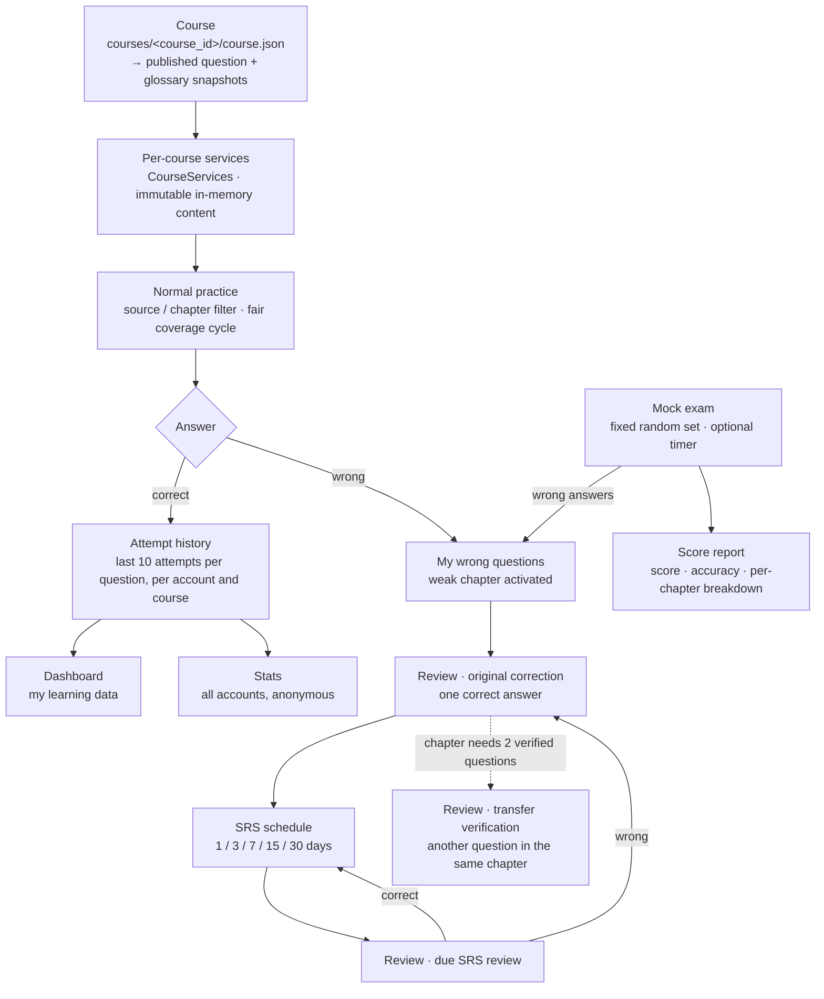

<div align="center">

# 课堂选择题学习助手

**Classroom MCQ Study Assistant**

**A local-first, multi-course multiple-choice learning assistant** — fair random practice, mistake review, spaced repetition, bilingual glossaries, learning analytics and mock exams. Runs on one Flask process and one local SQLite file.

一个本地运行的多课程选择题学习助手：公平随机练习、个人错题纠正、同知识点迁移验证、间隔重复复习（SRS）、中英双语术语辅助、学习数据统计与模拟考试。


[为什么做这个项目](#-why-this-project) ·
[快速开始](#-quick-start) ·
[工作原理](#-how-it-works) ·
[核心功能](#-core-features) ·
[课程内容](#-course-content) ·
[测试](#-testing) ·
[生产部署](#-production-deployment) ·
[文档](#-documentation)

</div>

## ✨ Why this project?

大多数刷题工具要么把题库焊死在代码里，要么把学习记录留在一个浏览器里。这个项目把两件事彻底分开：

- **内容是可插拔的 JSON**：每门课一个目录（`courses/<course_id>/`），新增课程、更换题库、改术语表都不需要修改 Python、Jinja、CSS 或数据库结构；
- **学习状态留在服务器端 SQLite**：换设备登录同一账号，打开或刷新页面就能接着上次的题目、答题反馈和巩固进度继续。

在「练习 → 答错 → 纠正 → 复习」这条主线上，它补上了几个通常只在付费产品里出现的细节：一轮练习有**公平随机覆盖**保证、错题必须真的被纠正（原题答对一次 + 同知识点再答对 2 道不同题）、纠正后进入 **1 / 3 / 7 / 15 / 30 天**的间隔复习，任何一次答错都会退回纠正流程。

### Feature Highlights

| Feature | What it does |
| --- | --- |
| 🎯 **Smart practice** | 按课件 / 章节筛选，单选与多选混排，题目和选项都随机；服务端 coverage cycle 保证同一轮不重复，覆盖完再重新洗牌。 |
| 🔁 **Mistake review & SRS** | 错题只属于本人：原题答对一次即完成纠正，所属知识点需 2 道不同题验证；纠正后按 1/3/7/15/30 天复习，答错回到纠正。 |
| 📚 **Multi-course isolation** | 课程由 manifest 声明、由 URL 决定；题目/章节/课件/术语 ID 都是课程内本地 ID，一门课坏掉不影响其他课程。 |
| 🌏 **Bilingual & glossary** | 英文优先，可切换「仅英文 / 中英双语」；题干与选项中的专业术语可点击查看中文释义，并有独立的术语学习页。 |
| 📊 **Progress & analytics** | 进度保存在服务器端、跨设备继续；个人 Dashboard 展示章节掌握度，另有不含任何账号明细的全员统计。 |
| 📝 **Mock exam** | 随机抽一套固定不重复的题，10–90 分钟或不限时；交卷后给出成绩、章节表现与错题解析，答错的题自动进入错题本。 |

## 🔄 How it works



每门课的入口都是 `courses/<course_id>/course.json`：manifest 决定这门课加载哪份已发布题库与术语表快照，worker 启动时把它们读进内存并装配成**这门课自己的** `CourseServices`（题目、章节、术语与全部 scoped 仓储都属于它）。课程由 URL 决定（`/course/<course_id>/...`），切换课程只是导航。

正常练习（Normal）、错题巩固（Review）和模拟考试（Exam）各自持有**互相独立的选题状态**：Review 不会消费 Normal 的 coverage bag，考试题集也不会改写两者。三个入口最终都只把作答写进同一份答题历史，统计页面只读它、不改它。

## 🚀 Quick Start

需要 Python 3（当前生产环境在 Python 3.10 上运行）。

### Windows PowerShell

```powershell
python -m venv .venv
.venv\Scripts\Activate.ps1
pip install -r requirements.txt
python run.py
```

### macOS / Linux

```bash
python -m venv .venv
source .venv/bin/activate
pip install -r requirements.txt
python run.py
```

打开 <http://127.0.0.1:5000>，首次使用时创建一个本地账号。账号只需要用户名和密码，密码以哈希形式保存在本地 SQLite 数据库（`instance/mcq.db`，首次启动自动创建）。

> [!IMPORTANT]
> `courses/`、`instance/`、根目录的 `*.json` 与 `deploy/` 都被 `.gitignore` 排除，因此**全新 checkout 里没有任何题库**，需要在 `courses/<course_id>/` 自备课程内容（见[课程内容](#-course-content)）。旧版的根目录 `questions.json` / `glossary.json` 仍然支持：没有 manifest 时会作为 `legacy` 课程加载。

`run.py` 使用 Flask 开发服务器（绑定 `127.0.0.1:5000`，`debug=True`，已关闭 auto-reloader），只适合开发与本地学习，不适合长期运行。生产部署见[生产部署](#-production-deployment)。

## 📁 Project Structure

```text
.
├── app/                    # Flask 应用：路由、服务、仓储、模型、模板与静态资源
│   ├── course_runtime.py   # CourseRegistry / CourseState / AppServices：每门课加载一次，之后只读
│   ├── routes/             # HTTP 端点与按课程 URL 分发
│   ├── services/           # 判题、Normal/Review 选题、错题与 SRS、统计、模拟考试
│   │                       # + course_service（每门课的依赖图）与 course_consistency（事务内写守卫）
│   ├── repositories/       # SQLite 访问、题库/术语表 Loader、课程加载与 schema 迁移
│   │                       # + course_loader / course_repository / course_scope / schema_migrations
│   ├── models/             # 领域模型（Question / Attempt / ExamSession …）+ course.py（课程身份）
│   ├── templates/          # Jinja 模板
│   ├── static/             # 原生 CSS 与 JavaScript（无构建步骤）
│   └── web/                # 请求层辅助：认证、课程上下文、视图 helper
├── courses/                # 课程内容（git-ignored）：每门课一个目录，含 course.json 与已发布快照
├── docs/                   # 课程、题库、术语表、架构与前端规范文档
├── scripts/                # 只读校验脚本、发布/删除/重命名工具（含共享的 course_tooling.py）、启停脚本
├── tests/                  # pytest 测试集
├── deploy/                 # 本机生产配置（systemd unit + Nginx 配置，git-ignored）
├── instance/               # 运行时 SQLite 数据库（git-ignored）
├── run.py                  # 开发入口：Flask 开发服务器
├── wsgi.py                 # 生产入口：要求 MCQ_SECRET_KEY，强制 Secure Cookie 与 CSRF
├── gunicorn.conf.py        # 生产 Gunicorn 配置（127.0.0.1:8001，2 × gthread worker）
├── requirements.txt        # Flask / Gunicorn / pytest
└── pytest.ini              # pytest 配置（testpaths = tests）
```

模块职责、请求流程与数据库结构的完整说明见 [技术架构说明](docs/ARCHITECTURE.md)；运维命令的完整参数见 [课程模型与运营手册](docs/COURSE_GUIDE.md)。

页面 URL 一律带课程：`/course/<course_id>/` 是本课程首页，其后是 `/quiz`、`/review`、`/mistakes`、`/glossary`、`/dashboard`、`/stats`、`/exam`。`/` 只会跳转到偏好课程，`/courses` 是课程列表。旧的、不带课程的历史 URL 仍然注册：`GET` 会重定向到显式课程 URL，`POST` 不会被猜测，而是返回 409 要求刷新（零写入）。

## 🧭 Core Features

### Practice

- 先在设置页选择范围：一份或多份课件的章节、某份课件的全部章节，或 `All Chapters`；再选择 `10 / 20 / 50 / 全部题目`。
- 选题在服务端按筛选范围建立随机 coverage cycle：优先抽取本轮覆盖周期中尚未出现的题，全部覆盖后重新洗牌；题目仍然随机，且单轮绝不重复。选择“全部题目”时每道符合条件的题恰好出现一次。
- 每轮同时随机题目与选项；刷新页面后题目队列与当前选项顺序保持不变。
- 单选和多选都必须至少选择一项才能提交；多选反馈区分“正确选择”“漏选”和“误选”。
- 练习页显示题目所属课件、章节、`section` 与页码。
- 进度按账号保存在服务器端：换设备登录后打开或刷新练习页，即可接续同一批题目、同一角色、同一答题反馈。

<details>
<summary><b>Advanced behavior：Normal 与 Review 的选题状态</b></summary>

```text
Normal:
source/chapter filter
→ eligible question IDs
→ random coverage bag
→ round queue

Review:
uncorrected wrong questions
+ due SRS reviews (corrected questions whose scheduled time has arrived)
+ active weak chapters
→ original correction / srs review / transfer verification
→ review queue
```

- Normal 只读取实时题库筛选结果和自己在 `quiz_progress` 中的 coverage 状态，不读取错题、薄弱知识点或 Review 进度；Review 选择迁移题时也不会消费或修改 Normal coverage bag。
- coverage bag 绑定筛选范围的签名：改变了章节筛选范围，就视为新的覆盖周期。
- Normal coverage、当前 Normal/Review 队列、题目角色、答案 token、反馈与选项随机种子都保存在服务器端 SQLite progress 中，**不放入 `localStorage`**。浏览器刷新、反馈重定向和另一设备继续都不会重新抽题；只有真正开始新的 Normal round 才消费 coverage bag，只有推进 Review queue 才生成后续迁移题。
- 模拟考试使用完全独立的状态：创建时用 `random.sample` 一次性抽出固定题集，与 Normal coverage bag、Review 队列互不影响，也不会改写它们。

</details>

### Mistake Review & SRS

- 每个账号只能查看和巩固自己的错题；正常练习、错题巩固与模拟考试中答错的题都汇入同一份错题记录。
- 每条错题记录包含错误次数与纠正状态；错题页按课件 / 章节下拉筛选（选中即筛选，无需额外按钮，两个条件可联合使用），并展示每个知识点的强化进度 `已验证 / 2 道不同题目`。
- 错题页始终显示最近一次错误答案和课程来源；**正确答案与解析只在完成巩固后显示**。
- 原错题在 Review 中答对一次即完成题目纠正；以 `chapter_ids` 作为知识点，同一知识点必须在 Review 中答对 **2 道不同题目**才完成强化。
- 原错题纠正后若知识点仍不足 2 道不同题，Review 会从同章节选择另一题做**迁移验证**；迁移题不会自动成为错题，只有实际答错时才会加入错题并重置相关知识点进度。
- 已纠正的错题不会永久消失：纠正完成后进入间隔重复（SRS）排期，按 `1 / 3 / 7 / 15 / 30` 天在 Review 中再次出现；连续答对逐级拉长间隔（30 天封顶），任何一次答错都会让该题重新回到纠错流程，重新纠正后从 1 天周期重新开始。
- Review 选题优先级：待纠正原错题 → 已到期的 SRS 复习题 → 同知识点强化题；同一道题在一次巩固中只会以一种角色出现。
- 首页“待处理”区在复习到期时显示“待复习 X 题”入口（巩固进行中时并入“继续错题巩固”行），没有待处理事项时该区域整体隐藏。错题页也显示今日待复习数量，只统计当前账号已到期的题目。
- 可在错题页确认后把**当前账号在当前课程中**的全部错题重置为 0：答题历史保留，其他账号与课程不受影响。

<details>
<summary><b>Advanced behavior：Review 的取舍规则与边界</b></summary>

- Review 继续复用正常练习的题卡、选项反馈和解析结构，只用次级 metadata/feedback 样式提示“错题纠正”“SRS 复习”或“同知识点强化”。
- 同一知识点如果题量不足 2 道，Review 会记录一条 shortage 警告而不是伪造验证；在这种情况下，返回唯一的原错题继续纠正优于留下未纠正的题目。
- 重置全部错题会同时清除该账号在当前课程的错题纠正状态和薄弱知识点状态，并结束各设备上该课程的错题巩固；正常练习（含 coverage 状态）与答题历史保留。
- 错题页与巩固页都会过滤掉已从题库中删除的题目；历史作答仍留在数据库中，但不再出现在错题列表里。

</details>

### Multi-course Support

- 每门课由 `courses/<course_id>/course.json`（manifest）声明，并加载自己的题库与可选术语库；`course_id` 必须是稳定的 URL-safe 小写 slug（允许 `_`、`-`，最长 64 字符）。
- URL 是唯一权威：`/course/<course_id>/...` 决定请求作用于哪门课程，`session` 里的“上次课程”只影响 `/` 的跳转，两个标签页分别打开两门课不会互相改写上下文。
- 题目、章节、课件与术语 ID 都是**课程内本地 ID**（注册表主键为 `(course_id, question_id)` / `(course_id, term_id)`），两门课可以都拥有 `q001` 而内容完全不同。
- 学习状态以 `(learner, course)` 为单位；账号（`user_id`）仍是全站身份，考试 ID 仍全站唯一，SQLite 仍是共享数据库，不按课程拆分。
- 单门课程内容损坏不会拖垮整个应用：该课程变为 `unavailable`、历史状态原样保留、其他课程继续服务；只有重复 `course_id`、manifest 无法解析这类**全局歧义**才会让应用装配失败。
- 术语表由 manifest 的 `glossary` 字段声明：`"glossary": null` 表示这门课明确没有术语表；声明了但文件缺失/损坏会让该课程 `unavailable`，而不是假装没有术语表。

### Bilingual & Glossary

- 题目默认显示英文；题目/选项/解析带中文辅助字段时，页面顶部出现「仅英文 / 中英双语」切换按钮（没有翻译时不显示），选择记在浏览器 `localStorage`。
- 题干、选项、答案反馈、解析和错题中的英文专业术语可点击或用键盘打开中文释义弹层；只使用**当前课程**的术语表，课程之间不会互相注入，也不会共用别名。
- 独立的 `/course/<course_id>/glossary` 页面支持中英文 / 别名搜索、按 `category` 动态分类筛选，以及「显示中文」逐条揭示的主动回忆；没有术语表的课程渲染明确的空状态。
- 术语身份只在课程内可见；修改 `glossary.json` 不影响题库指纹、generation 或任何学习记录。

<details>
<summary><b>Advanced behavior：术语匹配与字段规则</b></summary>

- 根对象必填 `schema_version`、`title`、`title_zh`、`terms`；`description` / `description_zh` 可选。
- 每个 term 必填 `id`、`term`、`term_zh`；可选 `aliases`、`definition_zh`、`category`。分类按 `terms[].category` 首次出现顺序生成，不需要维护第二份 categories 数组。
- 术语只写**中文释义** `definition_zh`：英文 `definition` 已退役，Loader 会忽略遗留键，`check_glossary.py` 会把它列为 `Retired term fields` 提示删除。
- Loader 拒绝重复 ID、标准化后重复的 canonical term、空 alias、term/alias 冲突，以及同一 alias 指向多个词条；匹配使用 Unicode 边界与最长匹配规则。
- 发布前运行 `check_glossary.py`：它只读内容，会报告未在学习语料中出现的 orphan entries，并给出大写缩写、括号缩写、连字符 token 等“可能遗漏候选”供人工复核——候选不会被自动写入术语表或自动翻译。

</details>

### Dashboard & Statistics

- 个人学习数据页 `/course/<course_id>/dashboard` 汇总当前账号：累计答题、总正确率、最近 7 / 30 天答题量、待纠正 / 已纠正错题（含今日到期复习数）、逐章节掌握度（正确率 + 覆盖题目数 + 状态分级）与最近 7 天每日答题趋势；没有答题记录时显示空状态。
- 掌握度分级：低于 60% 为薄弱，60–79% 进行中，80–89% 良好，90% 及以上掌握较好；作答少于 3 次的章节标记“数据较少”。
- 全员统计页 `/course/<course_id>/stats` 汇总所有账号：注册账号数、有作答的账号数、全员累计答题与总正确率、最近 7 / 30 天全员答题量、最近 7 天全员趋势，以及按全员正确率从低到高排序的章节难度榜（含作答人数与“较难 / 中等 / 较易”分级）。
- 全员统计只展示群体整体情况，**不展示任何单个账号的明细**，也不含待纠正错题、SRS 到期等个人化指标。
- 两个页面同样基于每道题每个账号保留的最近 10 次作答；页面时间与趋势日期按显示时区呈现（默认跟随服务器本地时区，可用环境变量 `MCQ_DISPLAY_TIMEZONE` 指定如 `Asia/Shanghai` 的 IANA 时区）。

### Mock Exam

- 从题库随机抽取一套固定、不重复的题：题目数量可选 `10 / 20 / 30 / 50`（只列出题库实际够用的档位）。
- 时限通过下拉选择：10–90 分钟（每 10 分钟一档）或**不限时（默认）**；服务端记录开考时间与时限，到时自动交卷，打开首页、考试中心或学习数据页时也会自动结算所有已到期考试。
- 考试过程不提示对错，可上一题 / 下一题；刷新或关闭页面后可继续，进行中的考试在首页“待处理”区有入口。
- 创建考试后题目集合即固定，与 Normal coverage bag、Review 队列互不影响，也不会改写它们。
- 交卷（或到时自动交卷）后生成成绩报告：总分、正确率、用时、章节表现拆分，以及每道错题的你的答案、正确答案与解析。
- 已作答的错题自动进入现有错题本与薄弱知识点流程，不重复创建错题记录；考试中心还保留最近 20 场考试的历史记录。

## 📚 Course Content

课程内容不在版本控制内（`courses/` 已被 `.gitignore` 排除）。每门课一个目录：

```text
courses/<course_id>/
├── course.json                  # manifest：课程身份与元数据，唯一权威指针
├── questions_candidate.json     # 题库候选文件：日常编辑的工作副本
├── glossary_candidate.json      # 术语表候选文件（可选）
├── versions/<sha256>/...        # 已发布内容的不可变副本（每个内容类型保留当前 + 上一版）
└── .publish.lock                # 发布锁，由 publish_course.py 维护
```

`python run.py` 以 `MCQ_ENV=development` 启动，因此开发默认值是：Session Cookie 不需要 HTTPS（纯 `http://127.0.0.1:5000` 可以登录并保持会话），遇到需要迁移的旧数据库时会先自动生成并校验一份带时间戳的备份再迁移。生产入口 `wsgi.py` 则声明 `MCQ_ENV=production`：Secure Cookie，并要求任何启动迁移都先有备份。

- `*_candidate.json` 是**默认输入**：`check_*.py` 与 `publish_course.py` 在不传文件路径时读取它们。
- `versions/…`（以及 plain-file 布局下 manifest 直接指向的 `questions.json` / `glossary.json`）是**已发布内容**，由 worker 读取，不要手工原地编辑。
- 如果 manifest 已指向 `versions/…`，目录根部的 `questions.json` / `glossary.json` 就不再被任何进程读取，编辑它不会生效。

> [!NOTE]
> 本仓库的 `courses/` 被 git 忽略，所以仓库本身**不附任何课程内容**：全新 clone 里没有 `courses/` 目录，题量、章节数与术语条数都取决于你自己部署的内容，不能当作项目的固定事实。本机的工作副本用真实课程验证过 manifest 声明、`versions/<sha256>/` 快照、按课程的 generate/围栏与术语高亮，但这些目录与统计数字不在版本控制内，也不随仓库发布。

推荐的最小 manifest（`questions`/`glossary` 指向不可变发布副本，`--add` 与每次发布都会把内容写到那里）：

```json
{
  "schema_version": 1,
  "course_id": "statistics",
  "title": "Statistics",
  "title_zh": "统计学",
  "enabled": true,
  "questions": "versions/<sha256>/questions.json",
  "glossary": "versions/<sha256>/glossary.json",
  "order": 10
}
```

plain-file 兼容布局（老课程或手工创建的课程）把这两个字段直接写成目录内的文件名：

```json
{
  "schema_version": 1,
  "course_id": "statistics",
  "title": "Statistics",
  "title_zh": "统计学",
  "enabled": true,
  "questions": "questions.json",
  "glossary": "glossary.json",
  "order": 10
}
```

两种布局都会被同一个 loader 加载；新课程请用上面的 versioned 形式。`glossary: null` 表示该课程明确没有术语表（字段缺失是 manifest 错误）。

最小题库（`schema_version: 2`）：

```json
{
  "schema_version": 2,
  "title": "Statistics Practice",
  "sources": [
    { "id": "stats-week1", "title": "Statistics — Week 1", "filename": "statistics_w1.pdf", "lecture": "Lecture 1 · Descriptive Statistics" }
  ],
  "chapters": [
    { "id": "descriptive-statistics", "source_id": "stats-week1", "title": "Descriptive Statistics", "order": 1 }
  ],
  "questions": [
    {
      "id": "q001",
      "source_id": "stats-week1",
      "chapter_ids": ["descriptive-statistics"],
      "section": "Measures of spread",
      "pages": [12],
      "text": "Which measure of centre is most affected by extreme outliers?",
      "text_zh": "哪个集中趋势统计量最容易受极端离群值影响？",
      "type": "single",
      "options": [
        { "id": "mean", "text": "Mean", "text_zh": "均值" },
        { "id": "median", "text": "Median", "text_zh": "中位数" }
      ],
      "correct_answers": ["mean"],
      "explanation": "The mean uses every value, so extreme values move it.",
      "explanation_zh": "均值使用了每一个数值，因此极端值会明显拉动它。"
    }
  ]
}
```

最小术语表（`schema_version: 1`）：

```json
{
  "schema_version": 1,
  "title": "Statistics Glossary",
  "title_zh": "统计学专业词汇",
  "terms": [
    {
      "id": "standard-deviation",
      "term": "Standard Deviation",
      "term_zh": "标准差",
      "aliases": ["SD"],
      "definition_zh": "衡量数据相对于均值离散程度的统计量。",
      "category": "Descriptive Statistics"
    }
  ]
}
```

基础规则（完整契约以 Loader 为准）：

- `type` 只能是 `single` 或 `multiple`；每题至少两个选项；`single` 必须恰好有一个正确答案。
- 多选题只有所选 ID 集合与正确答案集合完全一致时才算正确；判题使用 `option.id`，不受随机显示顺序影响。
- 题目 ID 在整份文件中唯一且**永不复用**；选项 ID 在同一道题内唯一。
- 提供 `sources` / `chapters` 时，每题必须包含有效的 `source_id` 和非空、无重复的 `chapter_ids`，且所有章节必须属于该 `source_id`。旧的单值 `chapter_id` 仍兼容（会自动转成单元素集合），但不能与 `chapter_ids` 同时提供。
- `pages` 如存在，必须为不重复的正整数数组；题目的 `chapter_ids` 可以包含同一课件下的多个章节，筛选任一所属章节都能找到该题。
- 旧题库可以省略 `sources` / `chapters`，此时所有题目归入默认的 `legacy / Uncategorized` 目录；`section` 与 `pages` 用于更精确地回溯原始资料。
- 中文字段 `title_zh`、`text_zh`、`explanation_zh` 只用于双语辅助显示，可以省略；省略后页面不显示对应翻译。题干、选项与解析文本支持用 `\n` 换行，罗马数字分点行（`I.` `II.` `III.` 开头）会以较小字号显示（见[题库编写指南](docs/QUESTION_GUIDE.md) 第 6.4 节）。

详细字段表、内容质量要求、生成与审核流程见 [题库编写指南](docs/QUESTION_GUIDE.md)、[术语库编写指南](docs/GLOSSARY_GUIDE.md) 和 [课程模型与运营手册](docs/COURSE_GUIDE.md)。

## ✅ Content Validation and Publishing

已有课程的内容更新遵循「修改课程目录内的候选文件 → 运行只读预检 → 发布 → 更新 worker → 验收」。新增、启停、删除和版本清理是不同的管理操作，不要把它们当成同一套发布流程。**任何返回非零的预检都必须先处理，不能用 `--skip-preflight` 绕过。**

| 操作 | 发布前检查 | 执行命令 |
| --- | --- | --- |
| 发布题库候选 | `python scripts/check_question_bank.py --course <course_id> --db instance/mcq.db`；若不允许清理任何学习状态，再加 `--strict` | `python scripts/publish_course.py --course <course_id> --questions courses/<course_id>/questions_candidate.json` |
| 发布术语表候选 | `python scripts/check_glossary.py --course <course_id>` | `python scripts/publish_course.py --course <course_id> --glossary courses/<course_id>/glossary_candidate.json` |
| 新增课程 | 先准备 `courses/<course_id>/questions_candidate.json`（术语表可选）；`--add` 自带 schema / 术语表门禁 | `python scripts/publish_course.py --course <course_id> --add --title "..."` |
| 重新启用课程 | `check_courses.py` 不加载 disabled 课程；应分别用 `check_question_bank.py --course <course_id> --published` 和（如已声明）`check_glossary.py --course <course_id> --published` 检查当前发布内容 | `python scripts/publish_course.py --course <course_id> --enable` |
| 停用课程 | 无内容预检；重启后生效，学习数据不删除 | `python scripts/publish_course.py --course <course_id> --disable` |
| 检查课程目录 / manifest | `python scripts/check_courses.py`；它会加载所有**启用**课程，但对停用课程只报告 `disabled` | 这是只读检查；`publish_course.py` 没有更新已有课程标题或 `order` 的通用 manifest 发布模式 |
| 清理 `versions/` | 无需单独预检；命令打印保留 / 删除数量和被删除的路径 | `python scripts/publish_course.py --course <course_id> --prune [--keep-versions N]` |
| 删除整门课程 | `python scripts/delete_course.py --course <course_id> --dry-run` | `python scripts/delete_course.py --course <course_id>`（有学习数据时确认后再加 `--force`） |

上表中的显式候选路径都从项目根目录开始。也可以完全省略 `--questions` / `--glossary`，让 `publish_course.py --course <course_id>` 自动寻找课程目录内的默认候选；但此时它会发布**所有存在且适用于当前 manifest 的默认候选**。如果只想发布一种内容，请使用上表中的完整路径。manifest 的 `glossary` 为 `null` 时，裸命令不会自动启用术语表，必须显式传 `--glossary`。

预检门禁有以下边界：

- 已有课程发布 `--questions` 时，脚本默认调用 `check_question_bank.py`；发布 `--glossary` 时，默认调用 `check_glossary.py`。`--skip-preflight` 只跳过这一步，基础 schema 校验仍会执行。
- `--add` 没有可供比较的课程历史，所以题库只做 schema 校验；提供术语表时还会做离线术语表检查。`--enable`、`--disable` 和 `--prune` 不调用内容预检。
- `check_question_bank.py` 默认允许 `grading-changed` / `deleted` 这类会清理部分学习状态的变更并返回 `0`；需要把它们作为发布阻断条件时，必须在人工预检中使用 `--strict`。发布脚本内部的题库预检不是 strict 模式。
- `check_glossary.py --course <course_id>` 会优先把 `questions_candidate.json` 与 `glossary_candidate.json` 配对检查；只执行 `publish_course.py --glossary ...` 时，内置预检使用的是当前已发布题库。若两个候选需要作为一组审核和上线，应先分别预检，再在同一发布命令中同时显式传入两者。

```bash
python scripts/publish_course.py --course <course_id> \
  --questions courses/<course_id>/questions_candidate.json \
  --glossary courses/<course_id>/glossary_candidate.json
```

manifest 布局下，单个内容类型的切换是原子的：冻结候选字节 → 写入 `versions/<sha256>/` → 用一次 `os.replace` 切换 manifest。无 manifest 的 legacy 布局没有 `versions/` 指针，脚本改为原子替换单个已发布文件。成功发布后会自动执行版本保留；`--prune` 主要用于单独整理或重试清理。

一条命令同时传 `--questions` 与 `--glossary` 时，两者**顺序执行、各自独立**，不是跨文件事务：题库可能已经切换成功，而术语表步骤随后失败。需要清晰失败边界时，应拆成两条命令发布。

> [!WARNING]
> 发布题库文件必须使用发布脚本（推荐 `python scripts/publish_course.py --course <course_id> --questions courses/<course_id>/questions_candidate.json`），不要直接 `cp` 覆盖 manifest 当前指向的文件，也不要用编辑器原地保存：写入中断时，正在启动的 worker 可能读到半截 JSON，报出误导性的 `Invalid JSON in question bank at line 1, column N`。

<details>
<summary><b>Advanced behavior：内容变更的实际影响（generation、退役 ID、数据结构变化）</b></summary>

**每个 worker 只在启动时加载并校验启用课程的题库与术语库。** 发布脚本只切换文件系统中的发布内容，不更新运行中 worker 的内存快照，也不直接推进数据库 generation；数据库同步发生在 worker 启动时。

| 变更类型 | generation | 仍在运行的旧 worker | 更新方式与验收 |
| --- | --- | --- | --- |
| 结构性题库变化：增删 / 恢复题目、判题规则或题目归属变化、课件 / 章节目录结构变化 | 首个加载新版本的 worker 在启动同步时将该课程 `+1` | generation 推进后，该课程学习页面返回 503；其他课程不受影响 | 统一更新全部 worker，再检查 `/ready/<course_id>` |
| 题目文案等 `content-only` 变化 | 不变 | 继续返回 200，但仍显示旧快照 | 需要滚动或统一更新 worker 才能显示新内容，并在页面抽查 |
| 题库标题、课件 / 章节标题、`lecture` / `filename` 或 JSON 格式等 `presentation-only` 变化 | 不变 | 继续返回 200，但仍显示旧快照 | 不需要为解除 generation 围栏而协调重启；要显示新内容仍需更新 worker |
| `glossary.json` | 不变 | 继续返回 200，并继续使用旧术语表 | 更新 worker 后在术语表页面或高亮结果中验收 |

`/ready/<course_id>` 只报告当前响应 worker 的课程状态以及 worker / 数据库 generation 是否一致，不比较已发布文件摘要。因此它能发现 `stale` / `unavailable`，却不能单独证明 `content-only`、`presentation-only` 或术语表新版本已经加载；结构性发布在尚无新 worker 启动并推进 generation 时也可能暂时仍返回 200。多 worker 部署还需要确认每个实例都已完成更新。

**题库按 `question.id` 逐题增量生效，不会清空全站学习数据：**

- 修改题干、翻译、解析、选项文案或顺序、`section` / `pages`、JSON 格式等普通维护，会完整保留所有账号的答题历史、错题纠正状态、SRS 排期、薄弱知识点状态和练习 / 考试进度。
- 修改某题的题型、正确答案集合，或删除 / 重命名已有选项 ID 时，会删除该题的历史作答与错题 / SRS 状态，并清理引用该题的薄弱知识点、未完成练习和进行中考试槽位。
- 删除题目会保留其历史作答，但静默移除它的错题 / SRS 状态，并清理相关薄弱知识点、未完成练习和进行中考试槽位。注意“保留历史作答”不等于“统计数字不变”：页面统计只统计仍在题库中的题目，因此删除题目后累计答题数可能下降、正确率可能变化；题目恢复后这些历史作答又会重新计入。
- 单门课程的无效题库不会阻止应用启动：该课程变为 `unavailable`，历史状态原样保留，其他课程继续服务。
- `glossary.json` 不参与题库同步，单独修改它不会影响学习记录。

**题目 ID 永久退役：** 数据库为**每门课程的每个题目 ID** 永久保存注册信息（判题身份、内容指纹、归属指纹、退役状态）。被删除题目的 ID 在该课程内永久退役，不能再分配给不同的新题——误判复用会让该课程变为 `unavailable`。误删的题目按原 ID、原判题规则加回即可自动恢复；发布前可用 `python scripts/check_question_bank.py --course <course_id>` 预检。

**结构性变化与 generation：** `chapter_ids` 或 `source_id` 的修改会改变题目归属（影响章节筛选、Review 与章节进度），课件 / 章节的增删、顺序或归属变化会改变 worker 的章节菜单与筛选校验，因此它们与增删题目、判题规则变化一样属于结构性变化：

- **该课程**的 generation 会 +1，运行旧内容的 worker 在该课程的学习页面（含 `/stats`）返回 503，直到 worker 重启；
- **其他课程完全不受影响**（generation、数据与请求行为都不变）；
- 非结构性修改不会围栏旧 worker；滚动更新期间，不同 worker 可能显示不同版本的题目或标签文案。

预检脚本会报告 `catalogue-changed` 与 `presentation-only`，并逐题列出 `new`、`content-only`、`placement-changed`、`grading-changed`、`deleted` 和 `resurrected`。其中 `presentation-only: yes` 的精确定义是“文件字节发生变化，但规范化后的题目字段和目录结构都没有变化”；题干或选项文案变化属于 `content-only`，不是 `presentation-only`。判断是否会推进 generation，应看 `generation would bump`、`catalogue-changed` 与题目级结构性分类，而不是只看 `presentation-only`。

**回退一步不需要手工操作：** 把保留的上一版当作候选重新发布即可（归档字节相同，因此不会产生新目录），也不允许手工 `generation--`。删除课程不要手工 `rm -rf`：课程目录之外还有 `courses` 身份、学习数据、`question_bank_state`、`question_registry` 退役记录和 `default_course_id` 偏好，请使用 `delete_course.py`。

新增一门课时顺序要调整：`check_courses.py` 只报告已声明的课程，而 `check_question_bank.py --course <id>` / `check_glossary.py --course <id>` 在课程创建前都会报 `Unknown course`。应先创建 `courses/<course_id>/` 并放入 `questions_candidate.json`（可选 `glossary_candidate.json`），再运行 `python scripts/publish_course.py --course <course_id> --add --title "..."`。`--add` 自带题库 schema 与术语表门禁；创建完成后再用 `--course` 补跑只读校验。完整步骤见 [课程模型与运营手册](docs/COURSE_GUIDE.md) 第 7 节。

</details>

## 💾 Data and Persistence

所有持久化状态都在一个本地 SQLite 文件 `instance/mcq.db` 中（应用启动时自动创建与迁移；`instance` 与数据库文件的权限会被自动收紧为 `0700` / `0600`）：

- 本地账号的用户名、密码哈希与创建时间；
- 每个账号每道题**最近 10 次**作答的模式、所选答案、结果与时间；
- 每个账号自己的错题次数与纠正状态，以及 SRS 排期（`srs_level` / `next_review_at`）；
- 每个账号以章节为单位的薄弱状态、Review 中已验证的不同 question ID 与强化进度；
- 每个账号正常练习与错题巩固的题目队列、Review item role、当前位置、选项顺序、反馈、本轮统计，以及 Normal coverage bag；
- 每个账号的模拟考试场次（题量、时限、状态、成绩、用时）与每场考试的固定题目集合和保存的作答；
- 永久课程身份与已接受元数据（`courses`）、schema / legacy 归属记录（`schema_meta`）；
- 题库注册与状态：**每门课程的**每个题目 ID 的判题身份、内容指纹、归属指纹与退役状态（`question_registry`），以及该课程当前的 `bank_version`、结构性 generation 与目录指纹（`question_bank_state`）——这些表只保存指纹与状态，不保存题目正文；
- 登录 / 注册失败的限流窗口（`auth_rate_limits`），用于阻止暴力尝试。

**换设备继续做题**

1. 在另一台设备打开同一个学习网站，登录同一账号。
2. 在首页选择“继续正常练习”或“继续错题巩固”。
3. 如果页面已经打开，刷新后即可看到另一台设备保存的最新进度（页面不会自动实时刷新）。

<details>
<summary><b>Advanced behavior：多设备边界、重置语义与升级迁移</b></summary>

- 在任一设备重新开始某种练习，其他设备也会使用该模式的新进度；重置全部错题会同时清除该账号在当前课程的错题纠正状态和薄弱知识点状态，并结束各设备上的错题巩固，但保留正常练习（含 coverage 状态）与答题历史。
- 如果提示答题页面已过期（课程或题库版本已更新），在同一设备重新进入练习即可继续；旧页面提交不会被猜测到其他课程，而是零写入地拒绝。
- 升级应用后需要重启程序。数据库布局由 `app/repositories/schema_migrations.py` 版本化维护：当前 `schema_version = 2`（多课程命名空间），升级时在**一个 `BEGIN IMMEDIATE` 事务**内重建表、逐行复制、按字段校验、替换并做 `foreign_key_check`，失败整体回滚、重复执行结果一致。已有账号、attempts 与 wrong questions 都会保留；已有错题按实时 `chapter_ids` 初始化为 0/2 的薄弱知识点。细节见 [技术架构说明](docs/ARCHITECTURE.md) 第 11 节与 [多课程迁移与回滚手册](docs/MULTI_COURSE_MIGRATION.md)。
- 注意：应用启动时会自动执行这个迁移，但**不会**先做带时间戳的备份。生产环境请按迁移手册的“停服务 → 备份 → `migrate_courses.py --dry-run` → 正式迁移 → 校验 → 启动”顺序操作。
- 旧 Normal progress 缺少 fairness 字段时，会在下一次新建 round 时自动初始化。
- 缺少新 role metadata 的旧未完成 Review progress 无法安全转换，只会清除该 Review round，不删除错题、薄弱状态、attempt history、Normal progress 或账号。
- 旧数据库列 `review_streak` / `mastered` 保留作无损兼容，当前语义为未纠正 / 已纠正，不再表示知识点掌握。

</details>

## 🧪 Testing

课程内容校验脚本是只读的，可以随时运行；`pytest` 会执行 `tests/` 下的完整测试集（配置见 `pytest.ini`）：

```bash
python scripts/check_courses.py        # 校验 manifest、路径与每门课能否加载
python scripts/check_glossary.py --all # 校验所有启用课程的术语表与覆盖情况
pytest
```

只需要检查某一门课的题库时：

```bash
python scripts/check_question_bank.py --course <course_id> --db instance/mcq.db
python scripts/check_question_bank.py --course <course_id> --strict    # 会清理学习状态的更新直接返回非 0
python scripts/check_question_bank.py --course <course_id> --simulate  # 在数据库副本上真实跑一遍 reconciliation
```

不经过课程目录、直接校验某两个文件（显式离线模式）：

```bash
python scripts/check_glossary.py --questions path/to/questions.json --glossary path/to/glossary.json
```

`check_question_bank.py` 退出码：`0` 可部署（可能同时打印“将清理学习状态”的警告）；`1` 题库校验失败；`2` 非法复用退役 ID；`3` `--strict` 下检测到学习状态清理；`4` 课程 / 数据库无法安全比对。`check_courses.py`：`0` 通过、`1` 单门课程加载失败、`2` 全局歧义（重复 `course_id`、manifest 非法）。

`publish_course.py` 会把这些码**原样转发**：它不含自己的“发布预检失败”码，预检返回 `2`/`3`/`4` 时命令也以 `2`/`3`/`4` 结束（`1` 表示发布侧被拒或术语表预检失败，`2` 也可能是用法错误，`0` 表示已发布）。`python scripts/publish_course.py --help` 会打印完整表格。

## 🚢 Production Deployment

生产环境在 Windows 11 + WSL2 的 Ubuntu 中运行，采用最小部署模型：一个 Nginx（**只监听回环**）→ 两个 Gunicorn gthread worker → Flask，全部 worker 共享同一个本地 SQLite 文件。

> [!IMPORTANT]
> 下面的命令里出现 `fangsihan`、`/home/fangsihan/CodeSpace/Python/MCQ_Template`、`/etc/mcq-template` 等**都是本机示例**，不是项目通用要求：换成你自己的部署用户、检出路径与配置目录即可。`deploy/` 目录被 `.gitignore` 排除，全新 clone 中不存在，需要按下面“systemd 与 Nginx 配置”的要点自行创建。

```text
公网 HTTPS 入口（TLS 终止）
      ↓
Sakura FRP / 安全隧道
      ↓
Nginx 127.0.0.1:8080（仅本机回源）
      ↓
Gunicorn 127.0.0.1:8001
      ↓
Flask
```

> [!CAUTION]
> **公网入口必须使用 HTTPS**，并把原始协议可靠地传递为 `X-Forwarded-Proto: https`。生产入口（`wsgi.py`）强制使用 `Secure` Session Cookie：直接把明文 HTTP 的 8080 端口暴露到公网会泄露登录凭据，且浏览器不会在后续 HTTP 请求中发送登录 Cookie。TLS 可以终止在受信任的公网反向代理、CDN 或隧道服务，但代理到本机的 8080 只能作为受保护的回源链路，**不能作为公网入口**。

`wsgi.py` 在启动时强制要求 `MCQ_SECRET_KEY`，声明 `MCQ_ENV=production`，并固定 `DEBUG=False`、`SESSION_COOKIE_SECURE=True`、`ENABLE_CSRF=True`，同时只信任一层代理头（`ProxyFix(x_for=1, x_proto=1)`）。

<details>
<summary><b>Production deployment (WSL2 + Ubuntu + Nginx + Gunicorn)：完整步骤</b></summary>

### 首次部署

在 WSL2 Ubuntu 中执行：

```bash
cd /home/fangsihan/CodeSpace/Python/MCQ_Template

sudo apt update
sudo apt install python3 python3-venv python3-pip nginx openssl

/usr/bin/python3 -m venv .venv-prod
.venv-prod/bin/python -m pip install -r requirements.txt
```

创建生产密钥。已有密钥文件时不要覆盖：

```bash
sudo install -d -m 0700 /etc/mcq-template

if ! sudo test -s /etc/mcq-template/mcq-template.env; then
    sudo sh -c 'umask 077; printf "MCQ_SECRET_KEY=" > /etc/mcq-template/mcq-template.env; openssl rand -hex 32 >> /etc/mcq-template/mcq-template.env'
fi
```

页面时间与 Dashboard 趋势日期默认跟随服务器本地时区；如果 WSL 系统时区不是本地时区，可在同一个 env 文件中追加 `MCQ_DISPLAY_TIMEZONE=Asia/Shanghai` 显式指定。

生产环境建议再追加一行 `MCQ_ENV=production`。`wsgi.py` 会自己 `setdefault` 这个值，写进 env 文件只是让 systemd 的意图更明确：它决定 Secure Session Cookie 以及“启动迁移前必须先生成并校验备份”的默认行为。**不要**在 env 文件中设置 `MCQ_SESSION_COOKIE_SECURE=false`：生产环境会拒绝启动（该开关只能在入口代码里显式关闭）。

### systemd 与 Nginx 配置

`deploy/` 已不再纳入版本控制（`.gitignore` 排除），本机使用的两个文件是 `deploy/mcq-template.service` 与 `deploy/nginx-mcq-template.conf`。全新 checkout 需要自行创建，它们的关键设置必须包括：

- service：`EnvironmentFile=/etc/mcq-template/mcq-template.env`，`ExecStart=.../bin/gunicorn --config .../gunicorn.conf.py wsgi:app`，`Restart=on-failure`，并且只给 `instance/` 目录写权限（`ReadWritePaths=.../instance`）；
- Nginx：`listen 127.0.0.1:8080;`（服务器不监听公网地址），`proxy_pass http://127.0.0.1:8001;`，`proxy_set_header X-Forwarded-Proto https;`，并拒绝 `.db` / `.sqlite*` / 点文件等路径。

安装（文件存在时）：

```bash
sudo install -m 0644 deploy/mcq-template.service \
    /etc/systemd/system/mcq-template.service
sudo systemctl daemon-reload

sudo install -m 0644 deploy/nginx-mcq-template.conf \
    /etc/nginx/sites-available/mcq-template
sudo ln -sfn /etc/nginx/sites-available/mcq-template \
    /etc/nginx/sites-enabled/mcq-template

if [ -L /etc/nginx/sites-enabled/default ]; then
    sudo unlink /etc/nginx/sites-enabled/default
fi

sudo nginx -t
sudo systemctl enable mcq-template.service nginx.service
sudo systemctl restart mcq-template.service
sudo systemctl restart nginx.service
```

### 权限

应用启动时会自动将 `instance` 和 SQLite 数据库权限分别收紧为 `0700` 和 `0600`。也可手工复核：

```bash
chmod 0700 instance
chmod 0600 instance/mcq.db
```

### 配置更新

修改 `deploy/` 中的配置后，重新安装并加载：

```bash
sudo install -m 0644 deploy/mcq-template.service \
    /etc/systemd/system/mcq-template.service
sudo systemctl daemon-reload
sudo systemctl restart mcq-template.service

sudo install -m 0644 deploy/nginx-mcq-template.conf \
    /etc/nginx/sites-available/mcq-template
sudo nginx -t && sudo systemctl reload nginx.service
```

### 日常启停

```bash
./scripts/start_production.sh   # 启动全部服务
./scripts/stop_production.sh    # 停止全部服务
```

脚本会提示输入 Ubuntu sudo 密码。它们只负责启停已经安装的服务，不会复制 `deploy/` 中的配置。

### 状态和日志

```bash
systemctl status mcq-template --no-pager
systemctl status nginx --no-pager

journalctl -u mcq-template -f
sudo tail -f /var/log/nginx/mcq-template.access.log
sudo tail -f /var/log/nginx/mcq-template.error.log
```

### 分层验证

在 WSL 中：

```bash
curl -i http://127.0.0.1:8001/health   # 进程存活
curl -i http://127.0.0.1:8001/ready    # 可以承接学习流量
curl -i http://127.0.0.1:8080/health
curl -i http://127.0.0.1:8080/ready
```

`/health` 只表示进程活着（旧内容的 worker 也会返回 200，因为它仍要能登录 / 登出）；`/ready` 汇总本 worker **声明且启用**的课程，只要有一门不是 `ready` 就返回 503 与每门课程的 `status` / `worker_generation` / `database_generation` / `reason`；`/ready/<course_id>` 报告单门课程。**汇总失败只表示“至少一门课程不可服务”，不会让健康课程的路由失败。** 监控与启动脚本应使用这两个端点。

在 Windows PowerShell 中：

```powershell
curl.exe -i http://localhost:8080/health
curl.exe -i http://localhost:8080/ready
```

### Sakura FRP 本地目标

```text
Tunnel type: 支持公网 HTTPS 的受信任隧道/反向代理
Local IP: 127.0.0.1
Local Port: 8080
Local HTTP URL: http://127.0.0.1:8080
```

隧道回源应连接 Nginx 的 8080，不要连接 Gunicorn 的 8001；公网侧必须启用有效 TLS 证书并强制 HTTP 跳转 HTTPS。

### 故障排查

- `502 Bad Gateway`：先执行 `systemctl status mcq-template`，再用 `curl http://127.0.0.1:8001/health` 检查 Gunicorn，最后查看 `journalctl -u mcq-template` 和 Nginx error log。
- `503 题库正在更新`：当前 worker 仍在使用该课程的旧内容（日志中会出现 `Course "<id>" is stale on this worker (worker=… db=…)`），或数据库被恢复到较旧备份。先 `curl http://127.0.0.1:8001/ready` 找到受影响课程，再统一重启 `mcq-template.service`，最后用 `curl http://127.0.0.1:8001/ready/<course_id>` 确认返回 200；不要手工修改 `question_bank_state.generation` 绕过检查。其余课程在此期间仍可正常学习。
- `503 该课程暂时不可用`：该课程内容加载失败（日志中会出现 `Course "<id>" is unavailable: …`），通常是因为 manifest 声明的文件缺失、题目 / 术语表校验失败。用 `python scripts/check_courses.py` 复核；修复后重启 worker。
- `Connection refused`：依次检查 Sakura FRP 的本地目标、Windows 的 `curl.exe http://localhost:8080/health`、`systemctl status nginx`、`systemctl status mcq-template`。
- `500 Internal Server Error`：查看 `journalctl -u mcq-template -n 100 --no-pager`；Flask 异常由 Gunicorn 写入该 journal。随后查看 `/var/log/nginx/mcq-template.error.log` 以关联代理请求。

</details>

## 📖 Documentation

| Document | Description |
| --- | --- |
| [课程模型与运营手册](docs/COURSE_GUIDE.md) | 课程 manifest 与目录布局、按课程 URL 与切课、运行时状态与故障隔离、新增/修改/停用/删除课程、按课程发布与回滚 |
| [题库编写指南](docs/QUESTION_GUIDE.md) | `questions.json` 契约：`sources` / `chapters`、题目与选项字段、多章节归属、题目 ID 稳定性、内容质量与语义审核、预检与原子发布 |
| [术语库编写指南](docs/GLOSSARY_GUIDE.md) | `glossary.json` 契约：字段表、别名设计、Unicode 边界与最长匹配、覆盖校验、浏览器验收与发布前检查清单 |
| [多课程迁移与回滚手册](docs/MULTI_COURSE_MIGRATION.md) | 旧单课程数据库迁移到多课程 schema 的过程、字段级验证、回滚步骤与兼容性限制 |
| [技术架构说明](docs/ARCHITECTURE.md) | 模块职责、请求流程、SQLite schema 与迁移、测试架构、部署模型与配置项 |
| [前端视觉与交互设计规范](docs/FRONTEND_DESIGN_SYSTEM.md) | 设计令牌、色彩与排版、布局与密度、组件配方、交互状态、无障碍规则与多课程选择器约定 |

## 🔧 Advanced Technical Notes

<details>
<summary><b>请求守卫与事务</b></summary>

所有学习者写入都包在 `guarded_learner_transaction` 中：在取得 SQLite 写锁（`BEGIN IMMEDIATE`）之后，依次重新确认课程仍然启用、worker 加载的 generation 与数据库一致、`form_context` 仍然有效，然后才执行业务操作与写入，最后提交。

- 学习表单的 action URL 都包含课程；表单携带服务端签名的 `form_context`，至少绑定 `course_id`、`operation` 与 `generation`，其中 `operation` 是**表单提交目标**的操作。
- Quiz / Review 保留 `answer_token`，与 `csrf_token` 一样按 UTF-8 字节做常量时间比较：缺失、被篡改或非 ASCII 的提交返回 400（零写入），不会变成未捕获异常。
- Exam 表单额外绑定 `position` 与 `question_id`，事务内重新确认 `position → 同一 question_id`，避免重排槽位后旧页面写到别的题目。
- 结果映射：stale worker → 503、stale form → 409、课程不存在 → 404、课程不可用 → 503。旧的无课程 `POST` 不会被猜测，直接返回 409 要求刷新。

</details>

<details>
<summary><b>运行时状态与就绪语义</b></summary>

| 状态 | 含义 | 学习页面 | 影响 `/ready` |
| --- | --- | --- | --- |
| `ready` | 已加载，且 worker generation == 数据库 generation | 200 | 是 |
| `stale` | 已加载，但数据库 generation 已推进 | 503（术语表除外） | 是（汇总 503） |
| `unavailable` | 已声明且启用，但内容加载 / 校验失败 | 503 | 是（汇总 503） |
| `disabled` | manifest `enabled: false`，故意不加载 | 503（停用提示） | 否 |
| `undeployed` | 数据库已知但本 worker 的课程目录未声明 | 503 | 否 |

`/ready/<course_id>` 对未知课程返回 404。术语表与登出属于 stale-exempt 页面：worker 陈旧时仍可访问，学习者始终能查资料并离开共用设备。

</details>

<details>
<summary><b>配置与环境变量</b></summary>

| 变量 | 作用 |
| --- | --- |
| `MCQ_SECRET_KEY` | 会话与表单签名密钥；生产入口（`wsgi.py`）要求必须设置。开发环境未设置时使用临时随机密钥并打印警告（重启会失效）。 |
| `MCQ_ENV` | 声明本进程是什么部署：`production` / `development` / `testing`。它决定环境相关的安全默认值（Session Cookie 是否 `Secure`、启动时如何处理旧 schema）。未设置表示“未知”，按**安全默认**处理（Cookie `Secure`、拒绝启动时自动迁移）。`run.py` 与 `wsgi.py` 会各自 `setdefault` 为 `development` / `production`。 |
| `MCQ_SESSION_COOKIE_SECURE` | 严格布尔（`1/0`、`true/false`、`yes/no`、`on/off`），覆盖 Session Cookie 的 `Secure` 标志。`MCQ_ENV=production` 下只允许设为真；非法值直接让启动失败。 |
| `MCQ_AUTO_MIGRATE` | 启动时如何处理需要迁移的旧数据库：`refuse`（拒绝启动并提示显式迁移）/ `backup-and-migrate`（先备份并校验再迁移）/ `migrate`（调用方已备份；`production` 下不允许）。默认值由 `MCQ_ENV` 决定，见下方“数据库 schema 与启动迁移”。 |
| `MCQ_DEFAULT_COURSE` | 导航偏好：决定没有显式课程 URL 的浏览器跳转到哪门课，**不会**重新归属历史数据。 |
| `MCQ_DISPLAY_TIMEZONE` | 页面时间与 Dashboard 趋势日期使用的 IANA 时区（如 `Asia/Shanghai`）；默认跟随服务器本地时区，非法值会让启动失败。 |

其他固定默认值（见 `app/__init__.py`）：Session 有效期 30 天、`SESSION_COOKIE_HTTPONLY=True`、`SESSION_COOKIE_SAMESITE="Lax"`、`MAX_CONTENT_LENGTH=64KB`、`ENABLE_CSRF=True`、知识点强化目标 `KNOWLEDGE_VERIFICATION_TARGET=2`。

`SESSION_COOKIE_SECURE` **不是固定默认值**：它由运行环境决定（见 `app/config.py`，规则集中在一个可单测的模块里）。解析优先级：入口代码显式传入 > 环境变量 `MCQ_SESSION_COOKIE_SECURE` > 环境默认值。

| 运行环境（`MCQ_ENV`） | `SESSION_COOKIE_SECURE` 默认 | 说明 |
| --- | --- | --- |
| `development` | `False` | 纯 HTTP 的 `python run.py` 能登录并保持会话（`run.py` 会设置 `MCQ_ENV=development`） |
| `production` | `True` | `wsgi.py` 会设置 `MCQ_ENV=production`，并额外在代码里显式传 `True` |
| `testing` | `False` | 测试客户端走 HTTP；结果不依赖开发机的环境变量 |
| 未设置 / 未知 | `True` | **安全默认**：进程说不清自己是什么时，不做降级假设 |

* `MCQ_SESSION_COOKIE_SECURE` 使用严格布尔解析（`1/0`、`true/false`、`yes/no`、`on/off`，大小写不敏感），其他值会让启动失败并报出允许值——**不会**用 `bool("false")==True` 静默误判。
* `MCQ_ENV=production` 时，环境变量**只能**把它打开、不能关闭：`MCQ_SESSION_COOKIE_SECURE=false` 会被拒绝并给出解释（避免 systemd env 文件里一个手误就静默降级）。确实要在生产关闭，必须在入口代码里显式传 `SESSION_COOKIE_SECURE=False`，届时会打印明文传输的警告。
* 反向代理：`wsgi.py` 用 `ProxyFix(x_for=1, x_proto=1)` 只信任一层代理头；Secure Cookie 的安全前提是公网入口为 HTTPS（见上文），本机 Nginx→Gunicorn 的回源链路不改变这一点。

</details>

<details>
<summary><b>安全默认值</b></summary>

- 响应头：`Content-Security-Policy`（`default-src 'self'`，脚本仅允许同源）、`X-Content-Type-Options: nosniff`、`X-Frame-Options: DENY`、`Referrer-Policy: strict-origin-when-cross-origin`、`Permissions-Policy`，以及 HTTPS 请求下的 `Strict-Transport-Security`。
- 登录 / 注册限流：按账号 10 次 / 5 分钟、按 IP 100 次 / 5 分钟、注册按 IP 10 次 / 小时；过期记录会被清理。
- 会话 Cookie 在生产入口为 `Secure` + `HttpOnly` + `SameSite=Lax`；`ProxyFix` 只信任一层代理头。
- 密码以哈希形式存储（Werkzeug / Flask 依赖栈），数据库中不保存明文。

</details>

<details>
<summary><b>旧版根目录兼容与数据库工具</b></summary>

根目录的 `questions.json` / `glossary.json` 仍然被支持：通过 legacy adapter 转换成一个虚拟 `CourseDefinition`（`course_id = legacy`），然后进入完全相同的注册表、scoped repository 与 service 装配流程——不存在第二套业务逻辑。如果根 `questions.json` 不存在，manifest 课程就是全部；此时 `legacy` 只作为数据库身份出现，`/courses` 会把它显示为 `undeployed`（未部署，不影响就绪度）。

| 工具 | 用途 |
| --- | --- |
| `python scripts/migrate_courses.py --db instance/mcq.db --dry-run` | 事务性、无损、幂等的命名空间迁移 / 检查（真实执行前会自动生成并校验带时间戳的备份） |
| `python scripts/rename_course.py --db instance/mcq.db --from <old> --to <new> [--rename-directory]` | 重命名一门课程的 namespace（`course_id` 是数据库中每张学习者表的首列）；`--rename-directory` 为“暂存 → 事务 → 转正”协议 |
| `python scripts/rename_course.py --db instance/mcq.db --courses-dir courses --recover [--dry-run]` | 收尾或回滚一次中断的 `--rename-directory`（依据数据库归属与目录位置决定） |
| `python scripts/delete_course.py --course <course_id> --dry-run` | 预览并删除课程目录、数据库 namespace 与全部引用（默认自动备份数据库；目录先隔离到 `courses/.trash/`，数据库提交后才物理删除） |
| `python scripts/delete_course.py --purge [--course <course_id>] [--dry-run]` | 只清理 `courses/.trash/` 中上次运行留下的待清理条目（不写数据库） |
| `python scripts/publish_course.py --course <course_id> --prune [--keep-versions N]` | 清理 `versions/`，每个内容类型只保留当前 + 上一版 |

迁移细节、验证与回滚见 [多课程迁移与回滚手册](docs/MULTI_COURSE_MIGRATION.md)。

**数据库 schema 与启动迁移**：应用启动时 `Database.initialize()` 会先做一次**只读探测**——schema 已是最新（版本相同且表齐全）时**不创建备份、也不多写任何文件**；只有真的需要重建表结构时才会进入受保护路径：

| `MCQ_ENV` | 启动时的默认行为 |
| --- | --- |
| `production` / `development` / `testing` | 先创建并校验 `mcq.db.bak-<UTC 时间戳>`（SQLite 在线备份 API + `PRAGMA quick_check` + 原子发布），成功后才在单个事务里迁移 |
| 未设置（未知） | **拒绝启动**，打印显式迁移命令（安全默认） |

* **备份失败即中止启动**，数据库保持未迁移；迁移事务失败会整体回滚，并留下那份已校验的备份副本（可解释、可恢复）。
* 并发启动（多 worker）通过 `mcq.db.migrate.lock` 串行化决策，只会产生一份备份。
* 想固定行为可用 `MCQ_AUTO_MIGRATE=refuse|backup-and-migrate|migrate`；`migrate` 在 `production` 下被禁止（生产启动必须自己生成并校验备份）。

</details>
