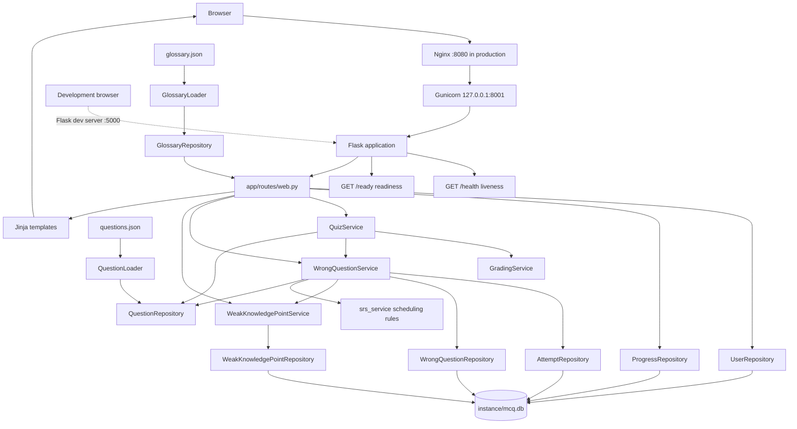
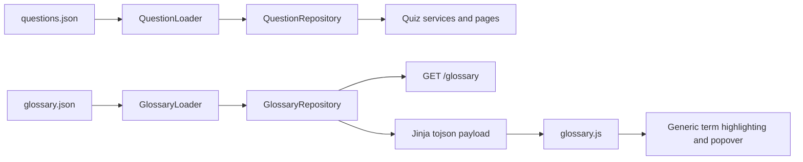

# Technical Architecture

## 1. Purpose and Scope

This project is a local, **multi-course** multiple-choice learning application built with Flask. Each course is declared by `courses/<course_id>/course.json` and loads its own English question bank and optional domain glossary from JSON. Question, chapter, source and glossary-term IDs are local to a course, so two courses may both own `q001` with completely different content; a learner belongs to the platform (`user_id`), while every piece of learning state belongs to `(learner, course)`. The application provides optional Chinese learning aids, grades single-choice and multiple-choice answers, stores personal learning history, gives normal practice a random coverage guarantee, and reviews mistakes through one-answer correction, same-chapter transfer verification, and fixed-interval spaced repetition (SRS) for corrected questions. On top of that loop, a dashboard aggregates each learner's recent statistics and chapter mastery, and a mock-exam mode draws a fixed, optionally timed question set whose mistakes flow back into the same correction system.

Operational details, URLs, per-course publication and readiness live in [COURSE_GUIDE.md](COURSE_GUIDE.md); the namespace migration, its validation and its rollback live in [MULTI_COURSE_MIGRATION.md](MULTI_COURSE_MIGRATION.md).

The application deliberately uses a small deployment model:

- the development server runs one Flask process on loopback;
- production runs two threaded Gunicorn workers behind one Nginx reverse proxy;
- each worker loads every enabled course's `course.json` + content into immutable in-memory repositories at startup, reconciles it once, and then holds a fixed generation per course for its whole lifetime;
- all workers share one local SQLite database through short-lived connections;
- server-rendered HTML uses a small amount of CSS and JavaScript;
- username/password accounts isolate each learner's records.

The project has four different kinds of state:

| State | Storage | Examples |
|---|---|---|
| Question-bank state (per course) | `courses/<course_id>/questions.json`, then immutable in-memory objects | question text, options, correct answers, explanations, Chinese translations |
| Glossary content | `glossary.json`, then immutable in-memory objects | canonical terms, aliases, translations, definitions, dynamic categories |
| Persistent learner state | `instance/mcq.db` | users, attempts, question correction state and SRS schedule, weak-chapter verification, normal/review progress |
| Temporary browser state | Flask's signed session cookie | signed-in user ID, flash messages |

Question content is not copied into SQLite. Persistent records refer to questions by their stable question IDs.

## 2. Technology Stack

- Python 3 (the deployed WSL2 environment currently uses Python 3.10)
- Flask 3.x for routing, sessions, templates, and HTTP handling
- Gunicorn 23.x as the production WSGI server
- Nginx as the production HTTP listener and reverse proxy
- systemd for Linux service supervision inside WSL2 Ubuntu
- Jinja for server-rendered HTML
- SQLite through Python's standard `sqlite3` module
- Werkzeug password hashing through Flask's dependency stack
- Vanilla JavaScript for form behavior and bilingual display
- Plain CSS for responsive styling
- Pytest for unit and integration tests

Python dependencies are managed only through `requirements.txt`: Flask `>=3.1,<4.0`, Gunicorn `>=23.0,<24.0`, and Pytest `>=8.3,<9.0`. No JavaScript build step, Redis instance, background worker, WebSocket server, or external database service is required.

## 3. High-Level Component Flow



The route layer translates HTTP input into service calls. Services implement learning rules. Repositories own data access. Domain dataclasses carry data between those layers.

## 4. Project Layout and File Responsibilities

```text
MCQ_Template/
├── run.py
├── wsgi.py
├── gunicorn.conf.py
├── requirements.txt
├── questions.json
├── glossary.json
├── README.md
├── pytest.ini
├── docs/
│   ├── ARCHITECTURE.md
│   ├── FRONTEND_DESIGN_SYSTEM.md
│   ├── QUESTION_GUIDE.md
│   └── GLOSSARY_GUIDE.md
├── deploy/
│   ├── mcq-template.service
│   └── nginx-mcq-template.conf
├── instance/
│   └── mcq.db
├── courses/                       # one directory per course (manifest layout)
│   └── <course_id>/
│       ├── course.json            # manifest: course_id, title, enabled, paths
│       ├── questions_candidate.json   # working copy the CLI reads by default
│       ├── glossary_candidate.json    # optional glossary working copy
│       ├── questions.json
│       ├── glossary.json          # optional; `"glossary": null` means none
│       └── versions/<sha256>/     # immutable publications written by the tooling
├── app/
│   ├── __init__.py
│   ├── course_runtime.py          # CourseRegistry / CourseState / AppServices
│   ├── models/
│   │   ├── __init__.py
│   │   ├── course.py              # Course, CourseDefinition, slug validation
│   │   └── domain.py
│   ├── repositories/
│   │   ├── __init__.py
│   │   ├── database.py
│   │   ├── course_loader.py       # manifest discovery, validation, bundles
│   │   ├── course_repository.py   # permanent course identity + schema_meta
│   │   ├── course_scope.py        # required course_id validation
│   │   ├── schema_migrations.py   # transactional namespace migration
│   │   ├── rate_limit_repository.py
│   │   ├── question_bank_state_repository.py
│   │   ├── glossary_loader.py
│   │   ├── glossary_repository.py
│   │   ├── question_loader.py
│   │   ├── question_registry_repository.py
│   │   ├── question_repository.py
│   │   ├── user_repository.py
│   │   ├── progress_repository.py
│   │   ├── attempt_repository.py
│   │   ├── exam_repository.py
│   │   ├── wrong_question_repository.py
│   │   └── weak_knowledge_point_repository.py
│   ├── services/
│   │   ├── __init__.py
│   │   ├── grading_service.py
│   │   ├── local_time.py
│   │   ├── progress_state.py
│   │   ├── quiz_service.py
│   │   ├── question_bank_sync_service.py
│   │   ├── question_fingerprint.py
│   │   ├── srs_service.py
│   │   ├── exam_service.py
│   │   ├── statistics_service.py
│   │   ├── global_statistics_service.py
│   │   ├── wrong_question_service.py
│   │   └── weak_knowledge_point_service.py
│   ├── web/
│   │   ├── __init__.py
│   │   ├── auth.py
│   │   └── view_helpers.py
│   ├── routes/
│   │   ├── __init__.py
│   │   └── web.py
│   ├── templates/
│   │   ├── base.html
│   │   ├── auth.html
│   │   ├── error.html
│   │   ├── glossary.html
│   │   ├── home.html
│   │   ├── dashboard.html
│   │   ├── stats.html
│   │   ├── quiz.html
│   │   ├── quiz_setup.html
│   │   ├── exam.html
│   │   ├── exam_setup.html
│   │   ├── exam_report.html
│   │   └── mistakes.html
│   └── static/
│       ├── css/style.css
│       └── js/
│           ├── app.js
│           └── glossary.js
├── scripts/
│   ├── check_courses.py
│   ├── check_glossary.py
│   ├── check_question_bank.py
│   ├── course_tooling.py
│   ├── delete_course.py
│   ├── migrate_courses.py
│   ├── publish_course.py
│   ├── rename_course.py
│   ├── start_production.sh
│   └── stop_production.sh
└── tests/
    ├── conftest.py
    ├── test_bundled_glossary.py
    ├── test_glossary_loader.py
    ├── test_glossary_repository.py
    ├── test_glossary_web.py
    ├── test_repositories.py
    ├── test_question_loader.py
    ├── test_question_bank_sync.py
    ├── test_question_metadata_migration.py
    ├── test_grading_service.py
    ├── test_local_time.py
    ├── test_quiz_service.py
    ├── test_wrong_question_service.py
    ├── test_learning_upgrade.py
    ├── test_srs.py
    ├── test_srs_web.py
    ├── test_security.py
    ├── test_statistics_service.py
    ├── test_global_statistics_service.py
    ├── test_exam_service.py
    ├── test_exam_web.py
    ├── test_dashboard_web.py
    ├── test_stats_web.py
    ├── test_progress_sync.py
    ├── test_progress_state.py
    ├── test_stale_worker.py
    ├── test_web.py
    └── test_bundled_question_bank.py
```

### Root files

#### `run.py`

This is the development-only executable entry point. It calls `create_app()`, converts a question-bank or glossary loading failure into a readable terminal message, and starts the Werkzeug development server with debug enabled on `127.0.0.1:5000`. Production never executes `app.run()`.

#### `wsgi.py`

This is the production WSGI entry point loaded as `wsgi:app`. It refuses to start unless `MCQ_SECRET_KEY` is present, explicitly disables Flask debug/testing mode, and wraps the application in `ProxyFix` configured for exactly one trusted Nginx proxy.

#### `gunicorn.conf.py`

Defines the loopback-only `127.0.0.1:8001` bind, two `gthread` workers, four threads per worker, timeouts, journald-compatible stdout/stderr logging, and bounded worker recycling.

#### `requirements.txt`

Defines the single Python dependency set used to run and test the project, including the production Gunicorn dependency. The Linux production packages are installed in `.venv-prod`; the existing Windows `.venv` remains separate.

#### `deploy/`

Contains source-controlled templates for the `mcq-template.service` systemd unit and the Nginx HTTP site. These files do not become active merely by editing them; deployment copies them to `/etc` and reloads the relevant service.

#### `scripts/start_production.sh` and `scripts/stop_production.sh`

Convenience operations scripts for WSL. The start script validates Nginx, starts Gunicorn and Nginx, verifies both services, and polls the `/ready` readiness URL (which fails while a worker still serves a superseded question bank). The stop script stops Nginx before Gunicorn and verifies that both are inactive. They control already-deployed services and do not copy templates into `/etc`.

#### `questions.json`

Contains the complete question bank. Every application process reads and validates it once during startup. Editing this file requires restarting the active server: `python run.py` in development or `mcq-template.service` in production. Replace it atomically (`scripts/publish_course.py --questions`) rather than with `cp` or an editor save: a partially written file is read by a worker starting in that window and reported as misleading invalid JSON.

#### `glossary.json`

Contains the active course's domain-neutral terminology metadata, canonical terms,
aliases, translations, definitions and optional categories. Every process validates
and loads it once at startup. It is independent of learner state and of every
question-bank fingerprint (`bank_version` plus the grading, content, placement and
catalogue fingerprints), so glossary maintenance never triggers reconciliation and
never fences sibling workers.

#### `docs/QUESTION_GUIDE.md` and `docs/GLOSSARY_GUIDE.md`

These are the user-facing authoring contracts for the two startup-loaded JSON files.
They document the fields accepted by the current loaders, validation commands,
content-quality guidance, replacement behavior, and release checklists.

#### `scripts/check_courses.py`

Course-level gate: validates every manifest (schema version, slug, required paths, path
containment, declared glossary) and loads every enabled course's question bank *and*
glossary through the application's own loader, reporting per-course status. Read-only: a
global catalogue ambiguity exits ``2``, a single broken course exits ``1`` while the
other courses are still reported.

#### `scripts/check_glossary.py`

Glossary gate: validates a glossary with `GlossaryLoader`, compares canonical terms and
aliases with learner-facing question-bank text, reports orphan entries, and emits
conservative manual-review candidates. It is read-only and does not generate or modify
glossary data. `publish_course.py` re-runs it (offline) before switching over a glossary.

Per course it reads the default working copies (`questions_candidate.json` /
`glossary_candidate.json` inside the course directory) when they exist and the published
files otherwise, always printing which two files it read; `--published` forces the
deployed files.

The three ``check_<subject>.py`` scripts are the read-only gates of the content flow
(check → publish → restart worker); the publish half and the full flow are documented in
[`COURSE_GUIDE.md`](COURSE_GUIDE.md) §7.10.

#### `scripts/delete_course.py`

The only supported way to remove a course, because a course is more than its directory.
It removes the content directory (manifest, published content, `versions/<sha256>/`
copies, `.publish.lock`) *and* every database reference in one audited operation: the
`courses` identity row, all course-scoped learner rows (`quiz_progress`, `attempts`,
`wrong_questions`, `weak_knowledge_points`, `exam_sessions` plus the `exam_questions`
slots they own), `question_bank_state`, `question_registry` and — when it points at the
deleted course — `schema_meta.default_course_id`. Safety comes from a `--dry-run` report,
a timestamped database backup, a refusal while learner rows exist unless `--force` is
given, a strict `--courses-dir` containment check, a refusal for the persisted
`legacy_course_id` namespace and the legacy root-file layout, and a per-table total
row-count re-check inside the transaction that rolls back rather than commit a partially
scoped deletion. Exit codes: `0` deleted (or dry run), `1` refused (nothing written),
`2` usage/IO.

#### `scripts/check_question_bank.py`

Pre-deploy gate for `questions.json`: validates the file with `QuestionLoader`, then
dry-runs the registry diff against a read-only copy of the live database and prints
exactly what startup reconciliation would do (new, content-only, placement-changed,
catalogue-changed, presentation-only, grading-changed, deleted, resurrected). The
candidate it validates is the explicit positional path, or — when none is given — the
course's default working copy (`courses/<course_id>/questions_candidate.json`) if it
exists, else the currently published file (`--published` forces that last case), and the
report always names the file it read. Exit
codes: `0` deployable (including allowed-but-destructive cleanups, which always print
a warning and never claim the deploy is data-loss-free), `1` invalid bank, `2` a
retired question ID is reused for a different question (startup would refuse to run),
and `3` under `--strict` when the update would clear learner state. It also reports
the two bank-level classifications — `catalogue-changed` (menus/filter validation
changed, so the coordinated restart is required) and `presentation-only` (bytes
changed with no fingerprint-visible change: labels or formatting, which is deployable
without fencing) — and lists retired IDs that have no recorded grading identity
(pre-registry tombstones), which a candidate bank must not rely on for identity
checks.

#### How to read the two bank-level report lines

`catalogue-changed` and `presentation-only` are *derived classifications*, not field
diffs: the database stores no label snapshot, only the `bank_version` and the
fingerprints. The script prints `presentation-only: yes` only when all three of these
hold: the candidate's raw bytes differ from the recorded `bank_version`; no
per-question fingerprint changed; and the catalogue shape is unchanged. In other words
the edit can only live in untracked fields (bank/source/chapter labels, `lecture`,
`filename`) or in JSON formatting/whitespace.

Consequences worth knowing:

- `presentation-only: no` must **not** be read as “labels did not change”. It is also
  printed for a byte-identical candidate (nothing to deploy), for any per-question
  change (a question *wording* edit is a `content_fingerprint` change and shows up
  under `content-only`), for any catalogue-shape change (reported by
  `catalogue-changed: yes`), for a database whose `question_bank_state` row is missing
  (no baseline to compare), and for a publish that mixes label edits with any tracked
  change.
- A formatting-only rewrite of an unchanged bank reports `presentation-only: yes`, so
  the flag answers “is this change attributable to labels/formatting?”, not “are the
  labels different?”.
- The flag never influences the exit code. Decide whether the coordinated restart is
  required from `catalogue-changed` and the per-question lines; `presentation-only`
  only confirms that this publish has no fencing or learner-data impact.

#### `scripts/publish_course.py`

The single publish entry point for every course-content type: add a course, publish
`questions.json` and/or `glossary.json`, and enable/disable a course. A publish reads the
candidate once, validates exactly those frozen bytes, archives them under
`versions/<sha256>/`, and switches the manifest over with a single `os.replace` (the
legacy root-file layout falls back to an atomic single-file replace). `--questions` and
`--glossary` default to the course's working copies
(`courses/<course_id>/questions_candidate.json` and `glossary_candidate.json`), so a bare
`--course <course_id>` publishes exactly the candidates a maintainer just edited; an
explicit path always wins, a glossary candidate is ignored for a course whose manifest
declares `glossary: null`, and a command with no content at all writes nothing. It re-runs
the matching gate by default — `check_question_bank.py` against the database for questions,
`check_glossary.py` for the glossary — and refuses to switch over content that fails it;
`--skip-preflight` is the explicit, discouraged escape hatch. Direct `cp` over a live file
(or an editor's in-place save) can truncate the JSON while a worker starts, which surfaces
as a misleading `Invalid JSON in question bank at line 1, column N`; this script removes
that failure mode. Publishing still requires a coordinated restart of all workers, because
a structural change advances the bank generation.

#### `instance/mcq.db`

The SQLite database created automatically on first startup. It contains accounts and learner activity, but not question text.

#### `pytest.ini`

Contains Pytest configuration used by the test suite.

## 5. Application Assembly

### `app/__init__.py`

This module is the composition root. Its `create_app()` function performs all application assembly:

1. Create the Flask application.
2. Load configuration, cookie defaults, and optional test overrides. If `MCQ_SECRET_KEY` is absent outside tests, generate an ephemeral development secret and log a warning.
3. Load and validate `questions.json` with `QuestionLoader`.
4. Build the in-memory `QuestionRepository`.
5. Load and validate `glossary.json` with `GlossaryLoader`, then build the immutable `GlossaryRepository`. The display timezone is resolved from `DISPLAY_TIMEZONE` once and injected into the statistics service and blueprint.
6. Initialize the current SQLite schema (including `question_registry` and the per-slot exam grading fingerprints).
7. Create the user, progress, attempt, exam, wrong-question, and weak-knowledge-point repositories.
8. Create the grading, weak-knowledge-point, wrong-question, quiz, and exam services, then run `QuestionBankSyncService.synchronize()`: the freshly loaded bank is diffed against the persistent per-question registry by stable `question.id`, and only genuinely affected data is reconciled — content edits keep everything, grading-identity changes clear exactly that question's attempts and correction state, and deleted questions keep their attempts but silently lose their correction/SRS state, weak-point references, progress-queue entries, and unfinished-exam slots. The bank generation only advances on structural changes (new, grading-changed, deleted, resurrected, chapter/source-moved questions, or a changed catalogue shape), never on cosmetic edits such as source/chapter titles. Missing weak rows are then backfilled from the surviving live wrong-question IDs with safe 0/2 progress.
9. Create the statistics and global statistics services.
10. Expose the assembled repositories and services through `app.extensions["mcq_services"]` for tests and diagnostics.
11. Register the application-level `GET /health` liveness route and the `GET /ready` readiness route.
12. Build and register the authenticated web blueprint.

Dependencies are created once and explicitly passed to the objects that need them. Route functions therefore do not construct databases or services during individual requests.

Important configuration values are:

| Setting | Purpose |
|---|---|
| `SECRET_KEY` | Signs Flask session cookies. Tests may override it; development generates a new random value when `MCQ_SECRET_KEY` is absent; `wsgi.py` requires the environment value in production. |
| `QUESTION_FILE` | Path to the active JSON question bank |
| `GLOSSARY_FILE` | Path to the active schema-version-1 JSON glossary |
| `DATABASE` | Path to the SQLite database |
| `KNOWLEDGE_VERIFICATION_TARGET` | Distinct correct Review question IDs required per active chapter; currently `2` |
| `DISPLAY_TIMEZONE` | Display timezone for rendered timestamps and dashboard trend days; defaults to the server local zone (environment `MCQ_DISPLAY_TIMEZONE`, IANA name such as `Asia/Shanghai`); invalid names fail startup fast |
| `PERMANENT_SESSION_LIFETIME` | Lifetime of a persistent login/session cookie |
| `SESSION_COOKIE_HTTPONLY` | Prevents browser JavaScript from reading the session cookie; enabled by default |
| `SESSION_COOKIE_SAMESITE` | Uses `Lax` cross-site behavior for the session cookie |
| `SESSION_COOKIE_SECURE` | Explicitly remains false in this HTTP-only deployment; enabling it without HTTPS would prevent the browser from sending the cookie |

The ephemeral development secret prevents a source-controlled fallback secret, but it also intentionally invalidates existing development sessions after a process restart. The production secret is stable, generated outside the repository, and loaded from the systemd environment file.

## 6. Domain Model

### `app/models/domain.py`

This file contains immutable dataclasses and the quiz-mode enum:

- `QuizMode`: distinguishes normal practice, mistake review, and mock exams.
- `ExamStatus`: the mock-exam lifecycle (`in_progress`, `submitted`, `expired`).
- `Option`: one answer option with English text and optional Chinese text.
- `SourceDocument` / `Chapter`: the normalized course-material catalogue used by all filters and labels.
- `Question`: one validated question, its options, correct answer IDs, explanations, one stable source reference, one or more chapter references, plus optional section/pages.
- `GlossaryTerm`: one canonical English term, Chinese translation, aliases, optional definitions, and an optional arbitrary category.
- `Glossary`: root glossary metadata and an immutable tuple of `GlossaryTerm` objects.
- `User`: one local account with a UUID, username, password hash, and creation time.
- `Attempt`: one persisted answer event.
- `WrongQuestion`: the current mistake and correction state for one user/question pair. Its `corrected` property maps to the legacy SQLite `mastered` column. It also carries the SRS schedule: `srs_level` (0 for a freshly corrected question) and `next_review_at` (ISO timestamp, `None` while uncorrected or unscheduled).
- `WeakKnowledgePoint`: one user/chapter pair containing active state and distinct verified Review question IDs.
- `ExamSession`: one persisted mock exam with its status, fixed size, optional time limit, deadline, and submission results.
- `ExamQuestion`: one fixed exam slot with its saved selection and graded outcome.

These objects do not know about Flask, HTML, or SQL. They are the shared data language between repositories and services.

### Package `__init__.py` files

The `__init__.py` files in `models`, `repositories`, `services`, and `routes` re-export the public objects used by other layers. They keep imports concise and define the intended public surface of each package.

## 7. Repository Layer

Repositories are responsible for loading or persisting data. They do not decide learning rules or render pages.

### `app/repositories/database.py`

`Database.initialize()` creates the current schema and indexes with `CREATE TABLE IF NOT EXISTS` and `CREATE INDEX IF NOT EXISTS`.

`Database.connect()` reuses the context-local connection when called inside `Database.transaction()`. Otherwise, it is a context manager that:

- opens a short-lived SQLite connection;
- configures rows for name-based column access;
- commits successful operations;
- rolls back failed operations;
- always closes the connection.

There is no database migration framework. Schema creation is additive, and column additions use guarded, idempotent `ALTER TABLE` statements: `Database.initialize()` checks `PRAGMA table_info(...)` before adding the `wrong_questions.srs_level` and `next_review_at` columns to databases that predate spaced repetition, and the `exam_questions.grading_fingerprint` column to databases that predate grading-identity tracking. Legacy rows keep `srs_level = 0` and `next_review_at = NULL`, so they are never scheduled until corrected again; legacy exam slots keep a `NULL` fingerprint and render as recorded. `weak_knowledge_points` and `question_registry` are created with `CREATE TABLE IF NOT EXISTS`, so an unchanged old database starts without a manual command. Bank changes never clear learner data wholesale anymore; see the per-question reconciliation section at the end of this document.

`Database.transaction()` uses `BEGIN IMMEDIATE` and a context-local connection so progress token checks, answer attempts, correction/weak-point updates and progress changes commit or roll back together. SQLite serializes these transactions across threads and Gunicorn workers. Repository operations inside the transaction reuse its connection.

### `app/repositories/rate_limit_repository.py`

`RateLimitRepository` owns the `auth_rate_limits` table that backs login and registration throttling. Identifiers are SHA-256 hashed before storage so raw usernames and IP addresses are never persisted. Each `(scope, identifier_hash)` row is a fixed-window counter (`window_started_at`, `expires_at`, `attempt_count`): `consume()` atomically clears expired rows, increments the counter, and reports whether the allowance holds, while `is_limited()` checks without consuming. Consumption runs inside `Database.transaction()`, so a rejected login and its recorded failure commit or roll back together.

### `app/repositories/question_bank_state_repository.py`

`QuestionBankStateRepository` is bound to one `course_id` and owns that courses single `question_bank_state` row: the last loaded raw bank fingerprint (diagnostic only), the normalized shape of that courses catalogue, and that courses structural bank generation counter which stale workers compare against. There is deliberately no global generation: a structural update of course A bumps only As row. It never touches learner data; per-question reconciliation lives in `QuestionBankSyncService`. `app/course_runtime.py` and `app/services/course_service.py` construct the course-scoped repositories (one graph per course); the rate-limit repository stays deployment-wide and is injected into the web blueprint. `Database` itself only manages connections, transactions, schema, and the per-`(learner, course, question)` retention sweep.

### `app/repositories/question_registry_repository.py`

`QuestionRegistryRepository` owns the permanent `question_registry` table — one row per question ID ever loaded, holding its grading identity (`question_type`, the option-ID set, the correct-answer set), a content fingerprint, a placement fingerprint (`source_id` + `chapter_ids`), and a lifecycle status. Rows are never deleted: a question that leaves the bank is only marked `retired`, leaving a tombstone that prevents the ID from being silently recycled for a human-different question later. Reappearing retired IDs are resurrected when the grading identity matches exactly, and rejected with a startup error otherwise; tombstones adopted from pre-registry learner history carry no grading identity and are therefore adopted on their first reappearance (see “Pre-registry tombstone compatibility”).

### `app/repositories/question_loader.py`

`QuestionLoader` reads raw JSON bytes, calculates a SHA-256 source fingerprint (recorded for diagnostics only; it never drives any data reset), validates the full document, and converts it into immutable `Question` and `Option` objects. Per-question content and grading fingerprints are computed later from the normalized model, so JSON whitespace or field order can never register as a change.

Validation includes:

- root and question-list types;
- unique question IDs;
- supported question types (`single` or `multiple`);
- at least two options per question;
- unique option IDs within a question;
- valid and non-duplicated correct-answer IDs;
- exactly one correct answer for single-choice questions;
- valid English and optional Chinese text fields.
- unique source/chapter IDs and valid chapter-to-source relationships;
- one source and one or more same-source chapter references on every question in a catalogued bank;
- positive, non-duplicated page numbers when supplied.

For backward compatibility, a bank with no `sources` and `chapters` arrays is loaded into one synthetic `legacy` / `Uncategorized` source and chapter. A bank that opts into the catalogue must provide valid metadata for every question.

An invalid bank raises `QuestionBankError` before the website starts, preventing a partially loaded quiz.

### `app/repositories/question_repository.py`

Stores all validated questions and the normalized curriculum catalogue in memory. It provides ordered iteration, lookup by question ID, server-side source/chapter filtering, ordered source/chapter access, and per-chapter question counts. It also holds the English and Chinese question-bank titles.

### `app/repositories/glossary_loader.py`

Reads and validates the separate glossary file. Normalization is used only to reject
duplicate or ambiguous labels; original strings remain unchanged for display and
literal browser matching. Validation errors identify the entry and field that failed.

### `app/repositories/glossary_repository.py`

Keeps the glossary process-wide and read-only, independent of SQLite. It provides
tuple-based term access, ID lookup, categories in stable first-appearance order, and
defensive JSON-ready serialization for templates.

### `app/repositories/user_repository.py`

Creates and authenticates local users. User IDs are UUID strings, usernames are unique without case sensitivity, and passwords are stored as Werkzeug password hashes rather than plaintext. `list_all()` returns every account ordered by username for the cross-account statistics service.

### `app/repositories/progress_repository.py`

Stores one JSON round state and question-bank fingerprint per `(learner_id, mode)`. `get()` distinguishes a missing row from a persisted null state; `save()` upserts the row. A null state marks cleared progress and must never be resurrected from a stale copy. The route wrapper owns the transaction covering progress and answer-related repositories.

### `app/repositories/attempt_repository.py`

Inserts one row for every graded answer, then retains only the ten most recent rows for that `(learner_id, question_id)` pair in the same transaction. Application startup also prunes older databases to the same limit. The selected option IDs are serialized as JSON so both single and multiple selections can use the same column. `list_for_learner()` returns one learner's retained window in chronological order for the statistics service; `list_all()` returns every account's window in the same order for the global statistics service — still bounded by learners × questions × the retention limit.

### `app/repositories/exam_repository.py`

Persists mock-exam sessions and their fixed question slots. Every read is scoped by `learner_id` so one account can never load another account's exam. `save_answer()` replaces one slot's selection (an empty selection clears it) and records the visited position for resume; `apply_grading()` stores per-slot outcomes; `finalize()` flips `in_progress` to a finished status with a conditional `UPDATE`, which is the idempotency guard against double submission. The active-exam query also filters out sessions whose deadline has passed (`get_active_for_learner`), so an expired exam never surfaces as resumable, and `list_expired_in_progress()` feeds the touch-based settlement sweep.

### `app/repositories/wrong_question_repository.py`

Maintains question-level state for each `(learner_id, question_id)` pair:

- a real wrong answer in either mode creates or reopens the record;
- every wrong answer increments `wrong_count`, clears the legacy `review_streak`, sets legacy `mastered=0`, and resets the SRS schedule (`srs_level=0`, `next_review_at=NULL`) so a failed review always returns to the plain correction flow first;
- one correct Review answer for an uncorrected record sets `review_streak=1` and `mastered=1`, whose current domain meaning is `corrected`, and starts the SRS schedule at level 0 with the supplied `next_review_at`;
- a correct Review answer for an already-corrected, due record advances the SRS schedule through `record_srs_reviewed()` (guarded by `mastered=1`);
- a correct Review answer for an already-corrected but not-yet-due record leaves the SRS schedule untouched;
- `get_due()` returns one learner's corrected records whose `next_review_at` has been reached (inclusive comparison on ISO UTC strings);
- a correct transfer question with no prior wrong record never creates one;
- resetting mistakes deletes only the signed-in learner's rows and leaves attempts intact.

The old columns are retained to avoid a destructive migration. They no longer represent chapter mastery or a two-answer streak.

### `app/repositories/weak_knowledge_point_repository.py`

Stores one row per `(learner_id, chapter_id)`. `active` records whether reinforcement remains required; `verified_question_ids` is a defensive JSON array of stable, distinct question IDs; `last_wrong_at` and `updated_at` provide minimal state timestamps. A wrong answer activates/reopens every chapter on the question and resets its JSON progress to `[]`. Verification saves are additive and learner-scoped. Malformed JSON is treated as empty rather than causing a request failure.

## 8. Service Layer

Services contain the application rules that are independent of HTTP and HTML.

The central boundary is:

```text
Normal Selection Policy != Review Selection Policy

Normal: filter → fairness selection → round queue
Review: wrong correction state + due SRS schedule + weak knowledge state
        → original/srs/transfer selection → review queue
```

### `app/services/grading_service.py`

`GradingService` validates submitted option IDs, removes duplicates, and grades by comparing sets of option IDs.

- Single-choice answers must match the one correct ID.
- Multiple-choice answers are correct only when the selected set exactly equals the correct set.
- Display order does not affect grading.
- Unknown option IDs raise `AnswerValidationError`.

### `app/services/quiz_service.py`

`QuizService` contains two explicitly separate selection policies plus shared grading:

**Normal Selection Policy**

1. `QuestionRepository.get_filtered()` resolves the live eligible IDs from source/chapter filters.
2. A SHA-256 scope signature is calculated from the sorted eligible IDs.
3. If the prior signature matches, validated remaining IDs are consumed; otherwise a new shuffled bag is created.
4. At a cycle boundary, the next full eligible set is shuffled. IDs already selected in the current round are retained for later in the new bag, not duplicated in the current round.
5. `all` shuffles every eligible ID exactly once and leaves no remaining bag.

Normal selection receives no wrong-question or weak-knowledge input. The route carries the resulting `fairness_scope` and `fairness_remaining_ids` into the next normal progress state only when `POST /quiz/start` creates a new round.

**Review Selection Policy**

- starts with all real wrong questions whose legacy database flag maps to `corrected=False`;
- each item records `original_correction`, `srs_review`, or `transfer_verification` and an optional target chapter;
- after pending originals, corrected questions whose SRS `next_review_at` has been reached are selected as `srs_review` items;
- after due SRS reviews, active weak chapters choose a random live same-chapter ID not already verified and not equal to the immediately preceding occurrence where an alternative exists;
- if a wrong original needs spacing, another pending original or a transfer question is preferred before falling back to immediate repetition;
- a question occupies exactly one state at a time (`corrected=False` rows never carry a due timestamp), so it cannot enter the queue twice through different roles;
- no weighted sampling and no Normal fairness state are used;
- when no distinct candidate exists, selection returns finite shortage metadata and logs a warning.

Both modes retain deterministic option shuffling from the round seed, question ID, and occurrence index. Answers are graded by option ID and passed to `WrongQuestionService`.

The deterministic option shuffle is important: options change between rounds, but refreshing a page or showing feedback does not reorder the current question.

### `app/services/wrong_question_service.py`

`WrongQuestionService` records every attempt exactly once and applies question/chapter boundaries.

For a normal answer:

- every result is written to `attempts`;
- an incorrect result creates or updates `wrong_questions`;
- the incorrect result also activates and resets every chapter in the question;
- a correct result does not change correction or knowledge verification.

For a review answer:

- every result is written to `attempts`;
- an incorrect result creates/reopens the concrete wrong question, clears its SRS schedule, and resets all of its chapter verification;
- a correct result marks an existing uncorrected wrong question corrected after that one answer and starts its SRS schedule (level 0, one day later);
- a correct result for an already-corrected question whose SRS review is due advances the schedule one level (3/7/15/30 days, capped at 30);
- a correct result for an already-corrected question that is not due leaves the schedule untouched;
- every correct result contributes its question ID once to each active chapter on the question;
- a transfer question is not inserted into `wrong_questions` unless its submitted answer is actually wrong.

It also joins persistent wrong-question records with live in-memory questions and each question's latest incorrect selection from `attempts`. Source/chapter filtering is applied to this joined model. If a recorded question ID no longer exists in `questions.json`, the item is skipped and a warning is logged. The same join/filter pipeline powers `get_due_srs_items()` / `get_due_srs_count()` / `get_filtered_due_srs_question_ids()`, which back the home-page "due today" entry and SRS review selection.

### `app/services/srs_service.py`

Pure, Flask-free spaced-repetition scheduling rules shared by the wrong-question service and its tests:

- `SRS_INTERVAL_DAYS = (1, 3, 7, 15, 30)` is the single source of truth for the level ladder; the last entry caps every level at or beyond it;
- `initial_schedule(now)` returns level 0 with `next_review_at` one day out, applied whenever a correction completes;
- `advanced_schedule(level, now)` increments the level and returns the next due timestamp for the new level;
- `is_due(next_review_at, now)` compares aware UTC datetimes and treats the exact scheduled moment as due;
- `utc_now()` / `parse_timestamp()` centralize time handling; naive stored timestamps are interpreted as UTC so naive/aware comparisons never mix.

Every function accepts `now` explicitly, which keeps scheduling deterministic under test. There is no background scheduler: "due" is only evaluated when a learner opens a page or enters Review.

### `app/services/weak_knowledge_point_service.py`

`WeakKnowledgePointService` owns chapter-level rules:

- all `question.chapter_ids` activate and reset after any real wrong answer;
- only a correct Review answer adds verification;
- IDs are intersected with current live same-chapter repository IDs and deduplicated;
- two distinct IDs mark the chapter inactive/completed;
- a later wrong answer reactivates it with 0/2;
- summaries join stable chapter titles, pending concrete wrong counts, available distinct question counts and verification progress;
- old wrong rows with no weak state are backfilled once with active 0/2 state.

### `app/services/progress_state.py`

Pure, HTTP-independent helpers that validate and describe the per-mode quiz progress state dictionaries. It centralizes the progress `session_key()` names, the `quiz_limit()` parsing for the selected practice size, the `is_valid_progress_state()` structural validation used to accept or clear a stored round, `valid_state_for()` which drops invalid entries, and `active_summary()` which builds the resume banner data for an unfinished round. `reconcile_state()` removes unusable question IDs from an unfinished round in lockstep across the queue, review items, and per-question results, decrementing the round counters so a bank edit never strands a round. `PRACTICE_MODES` names the two modes that own a resumable round; mock exams keep their own persisted state and are deliberately excluded. Keeping these rules here lets the route layer and tests share one definition of what a valid round looks like without touching Flask.

### `app/services/question_fingerprint.py`

Pure fingerprint helpers over the normalized `Question` model. `grading_fingerprint()` hashes exactly the grading identity (type, option-ID set, correct-answer set); `placement_fingerprint()` hashes the filing identity (`source_id` plus `chapter_ids`), which drives chapter filtering, Review selection and chapter progress; `catalogue_fingerprint()` hashes the shape of the whole catalogue (source IDs in order, chapter IDs with their source assignment and order, sorted by `(order, id)`); `content_fingerprint()` hashes every validated content field. All canonicalize before hashing, so JSON formatting can never register as a change, and none ever replaces `question.id` as identity. `catalogue_fingerprint()` deliberately excludes source/chapter *labels*, so a title edit cannot fence workers.

### `app/services/question_bank_sync_service.py`

`QuestionBankSyncService` runs once per worker startup inside a single `BEGIN IMMEDIATE` transaction. It bootstraps an empty registry from the deployed bank (adopting IDs that only exist in learner history as retired tombstones, and backfilling a placement baseline for rows written before placement tracking), classifies the diff (`diff_questions()` is a pure function shared with the pre-deploy check script), fails fast when a retired ID is reused for a grading-different question, and applies the per-question consequences: targeted attempt/correction deletion for grading changes, silent correction/SRS removal plus weak-point, progress-round, and unfinished-exam reconciliation for unusable questions, and a generation bump for structural changes (including chapter/source moves, which keep learner records but change what the bank means). It also compares the stored `catalogue_fingerprint()` with the loaded catalogue and bumps the generation when the catalogue shape changed, because menus and filter validation are per worker; a database that predates catalogue tracking adopts the current shape as its baseline instead. Everything is idempotent, so a second worker's run is a no-op.

### `app/services/exam_service.py`

`ExamService` owns the mock-exam lifecycle. Creation validates the requested size and time limit against fixed allow-lists and the live bank size, then freezes a random, deduplicated question set with one option seed. Answers are stored verbatim (empty selections clear a slot) without grading or attempt writes, so learners can revisit questions freely. The server-side deadline is authoritative: `is_expired()` uses an inclusive comparison, `finalize_if_expired()` auto-submits on any exam page load or answer save after the deadline, and `finalize_expired_for_learner()` settles all of one learner's expired exams when they open the home, exam, or dashboard page, so results, attempts, and mistakes are persisted promptly without any background worker; `get_active_session()` additionally hides deadline-passed exams from resume entry points. All time checks accept an injected `now` for deterministic tests. `submit()` grades the frozen answers, flips the session through the repository's conditional update (making double submits no-ops), and forwards each answered question to `WrongQuestionService.record_attempt()` exactly once with mode `mock_exam`; unanswered slots count as wrong in the score but create neither attempts nor mistake records. Reports aggregate the stored grading per chapter in curriculum order.

### `app/services/local_time.py`

Resolves and converts the display timezone. Storage and all comparisons stay in UTC; this module only governs what users see. `resolve_display_timezone()` turns the configured IANA name into a `zoneinfo.ZoneInfo`, falls back to the server-local zone when unset, and raises `InvalidTimezoneError` for unknown names so misconfiguration fails at startup. `to_display()`, `display_day()`, and `timezone_label()` are the only conversions used by the statistics service and the view helpers.

### `app/services/statistics_service.py`

`StatisticsService` aggregates the dashboard from one learner's retained attempt window plus the existing wrong-question state machine. It reports total/correct counts and accuracy, 7- and 30-day activity counts (inclusive day cutoffs on UTC timestamps), pending/corrected mistake counts with due SRS reviews, per-chapter mastery (attempts, accuracy, coverage against the live bank, and a threshold-based status: not started, weak below 60%, progressing below 80%, good below 90%, mastered at 90%+, with a low-sample flag below 3 attempts), and a 7-day per-day trend that fills empty days with zeros and buckets attempts by display-timezone calendar day. All bands are module constants and every function accepts an injectable `now`; the zone defaults to UTC and `create_app` injects the resolved display zone. The window cutoff (`count_since`) and day-bucketing (`daily_trend`) rules live at module level so the global statistics service shares them exactly.

### `app/services/global_statistics_service.py`

`GlobalStatisticsService` is the reference-only counterpart of `StatisticsService`: it aggregates the retained attempt window across every registered account and never reports single-account detail. It feeds the `/stats` page with registered/active account counts (active means at least one retained attempt), group totals and accuracy, the same 7/30-day activity windows, the same 7-day zero-filled trend, and a per-chapter difficulty board — attempts, accuracy, distinct answering accounts, and a difficulty band (unattempted, hard below 60%, medium below 80%, easy at 80%+, reusing the personal mastery thresholds) sorted hardest first with unattempted chapters last in curriculum order. Per-learner concepts (pending mistakes, SRS due counts) are excluded by design. Window, trend, and low-sample rules are imported from `statistics_service`, and `now`/display-zone injection keeps every rule unit-testable.

## 9. HTTP and Session Layer

### `app/routes/web.py`

This module creates the Flask blueprint and defines all browser endpoints.

| Method | Path | Purpose |
|---|---|---|
| GET | `/health` | Liveness: return `{"status":"ok"}` after application assembly succeeds; public and used for layered production checks |
| GET | `/ready` | Aggregate readiness over this worker's *declared, enabled* courses: `{"status":"ready",...}` with 200 only while every one of them is `ready`, otherwise `{"status":"degraded","courses":{"<course_id>":{"status","worker_generation","database_generation","reason"},...},"enabled_course_count":N,"ready_course_count":M}` with 503. The aggregate is a monitoring signal only: a stale course A never makes course B's routes fail |
| GET | `/ready/<course_id>` | Per-course readiness: 200 when that course is `ready`, 503 when it is `stale`/`unavailable`/`disabled`, 404 when no such course is declared |
| GET/POST | `/login` | Show the login form or authenticate a user; a signed-in visitor is redirected to `/` on a healthy worker and to `/glossary` (with the bank-update notice) on a stale one |
| GET/POST | `/register` | Show the registration form or create a user; the same stale-aware redirect applies after a successful registration |
| POST | `/logout` | Clear the signed-in session |
| GET | `/` | Show personal counts and practice controls |
| GET | `/glossary` | Show the active course glossary with live search and category filtering |
| POST | `/quiz/start` | Start or restart normal practice |
| GET | `/quiz/setup` | Dynamically list course materials/chapters before normal practice |
| GET | `/quiz` | Render the current normal-practice question or result |
| POST | `/quiz/answer` | Validate and grade the current normal answer |
| POST | `/quiz/next` | Advance normal practice |
| GET | `/mistakes` | Show only the signed-in user's mistake records |
| POST | `/mistakes/reset` | Reset only the signed-in user's mistake state to zero |
| POST | `/review/start` | Start or restart correction plus weak-chapter review |
| GET | `/review` | Render the current review question or result |
| POST | `/review/answer` | Validate and grade the current review answer |
| POST | `/review/next` | Advance the review queue |
| GET | `/dashboard` | Show per-learner totals, chapter mastery, and recent activity |
| GET | `/stats` | Show cross-account totals, chapter difficulty, and group activity; reference-only, no single-account detail, but fenced by the bank generation exactly like `/dashboard` |
| GET | `/exam` | Show mock-exam configuration, the resumable exam, and history |
| POST | `/exam/start` | Validate the configuration and create a fixed question set |
| GET | `/exam/<exam_id>` | Render one exam question without feedback; auto-submits when expired |
| POST | `/exam/<exam_id>/answer` | Save one exam answer without grading feedback |
| POST | `/exam/<exam_id>/submit` | Finalize the exam exactly once and redirect to its report |
| GET | `/exam/<exam_id>/report` | Show the immutable score report for a finished exam |

`/health` and `/ready` are registered directly on the Flask application before the web blueprint. They therefore do not run the blueprint's account requirement and do not expose learner, database, question, or secret data. `/health` answers while the process is merely alive (a stale worker must still be able to serve the login/logout pages); `/ready` is the signal monitoring and the start script should use, because a worker whose bank generation no longer matches the database only answers 503 for learning pages.

The blueprint's second `before_request` hook, `resolve_course_context`, does three things. First it binds the request to exactly one course: the `<course_id>` URL variable is the only authority, and the course''s live state is recomputed against the database (so a course whose generation moved is fenced immediately, without any process-wide flag). A course-less legacy URL is redirected for a `GET` — resolving an `exam_id` to the course that actually owns it, after checking learner ownership — and refused with 409 for anything else, so a stale form is never guessed into a course from the session. Second, it rejects a `POST` whose signed `form_context` is missing or untrusted. Third, it records `session["last_course_id"]`, which is only a navigation preference for `/`. `POST /logout`, `GET /login`, `GET/POST /register`, `/courses`, and `GET /glossary` are exempt from the per-course fence, so a learner on a shared device can always sign out, pick another course, and read reference material. Those exempt account pages share `_redirect_after_sign_in()`, which never hands a learner to a page that can only answer 503: on a healthy worker it redirects to the course home, on a degraded one to `/courses` plus the notice "题库正在更新，暂时只能浏览课程列表与术语表；…". Each course''s 503 page names the affected course, renders "题库正在更新，请稍后刷新页面；如果长时间未恢复，请联系管理员。", sets `Retry-After`, offers the course selector and a logout form, and never links back into the same 503, so it cannot loop. The same request may also be rejected inside the write transaction by `app/services/course_consistency.py`, which re-checks the course''s servability, the worker''s loaded generation and the signed form context after `BEGIN IMMEDIATE`; that is what closes the "outer pre-check passed, sibling published, then we write" race.

### `app/web/` request helpers

Two small modules keep cross-cutting HTTP concerns out of the route functions:

- `app/web/auth.py` holds the authentication, CSRF, and login rate-limit helpers. It resolves `session["user_id"]` to a real user for the blueprint's account requirement, issues and checks the CSRF token carried by mutating forms, and consults `RateLimitRepository` to throttle repeated failed logins.
- `app/web/view_helpers.py` holds the template and catalogue helpers that assemble the course/chapter selection lists and other view models shared by the practice and review screens, plus the display-timezone-aware timestamp/duration formatters injected into every template.

The authentication hook resolves `session["user_id"]` to a real user. Missing or invalid accounts are redirected to `/login`. Protected views then run inside the `shared_progress` wrapper: it loads both practice modes from SQLite, defensively drops question IDs that are no longer answerable, runs the view, and persists changed states in one transaction. Server-side rows are the only source of progress; any ancient cookie copy is purged without being read. Bank maintenance is silent — no flash or banner. A stale worker never reaches the wrapper because `resolve_course_context` already answered 503, and the wrapper still re-checks the generation inside the write transaction (`guarded_learner_transaction`) so a publication that lands between the pre-check and the write changes nothing. `POST /logout` deliberately stays outside the wrapper so signing out always works. The wrapper decides whether a row needs writing by comparing the practice state only: `bank_version` is diagnostic, so two workers running banks that differ only in wording must not overwrite the same `quiz_progress` row back and forth inside the global write lock.

The routes use the Post/Redirect/Get pattern after answer submissions. This prevents a normal browser refresh from resubmitting the form.

### Shared quiz progress structure

`ProgressRepository` stores normal and review progress in `quiz_progress`, keyed by `(learner_id, mode)`. The request-local keys `quiz_progress_normal` and `quiz_progress_review` are kept in `g`, never written to the browser cookie. Each device reads the same state when opening or refreshing a page; there is no background polling or push update. Devices must reach application instances sharing the same SQLite file. Logout preserves both modes. Restarting a mode replaces that account’s round for every device; resetting mistakes clears its review round while preserving normal progress and answer history.

Each state dictionary contains fields such as:

| Field | Meaning |
|---|---|
| `mode` | `normal` or `review` |
| `question_ids` | Current ordered queue of question IDs |
| `current_index` | Position in the queue |
| `correct_count` / `incorrect_count` | Attempt counters for the current round |
| `status` | Whether the current question is pending or answered |
| `answer_token` | Token for the current question occurrence, checked by answer and next forms and rotated on advance; the status check prevents duplicate grading |
| `option_seed` | Seed used to keep option order stable for the round |
| `requested_size` | Selected normal-practice size |
| `chapter_ids` / `source_ids` | Stable curriculum filters for restarting the same focused round |
| `initial_question_count` | Number of questions present at round start |
| `fairness_scope` / `fairness_remaining_ids` | Normal-only eligible-set signature and remaining coverage bag |
| `review_items` | Review-only queue metadata: question ID, `original_correction` / `srs_review` / `transfer_verification`, and optional target chapter |
| `corrected_count` / `knowledge_completed_count` | Review round outcomes |
| `review_shortages` | Finite completion metadata when a chapter has too few distinct live questions |
| `feedback` | Temporary result data for the answered question |

The signed session cookie retains authentication and flash messages only; server-side rows are the sole source of practice progress and any legacy cookie copy is discarded unread. A null state is retained after reset or invalidation to prevent stale devices from restoring cleared progress. Answer and next forms carry the current answer token, preventing stale devices from answering or advancing a later question. Authenticated responses use `Cache-Control: no-store`.

Old Normal progress remains valid without fairness fields; the next new Normal round initializes them defensively. Old unfinished Review progress without `review_items` cannot preserve occurrence roles safely, so validation clears only that Review row to a null tombstone. Wrong questions, weak points, attempts, Normal progress and users remain intact.

### Review queue behavior

`POST /review/start` persists all currently uncorrected originals as role-bearing queue items; when none are pending, all currently due SRS reviews are queued instead. Answer submission persists grading and feedback but does not randomize the next candidate. Only `POST /review/next`, after advancing beyond the existing queue, asks the Review Selection Policy for one later item: a pending original first, then a due SRS review, then a same-chapter transfer. The generated question ID, role, target chapter, option seed, token and feedback therefore remain stable across GET refreshes and devices.

The queue ends only when its selected scope has no uncorrected original, no due SRS review, and no active weak chapter below 2/2. If the live bank cannot supply two distinct IDs, the service does not loop or count a duplicate; it leaves the chapter active, logs a warning, and completes the finite page with a shortage explanation.

### Error handling

The blueprint converts common HTTP errors into the Chinese `error.html` page. This covers invalid submissions, expired quiz state, missing pages, removed questions, unsupported methods, server errors, the stale-course 503 (which also gets a `Retry-After` header), the unavailable/disabled-course 503, the unknown-course 404, and the stale-form 409. The page names the affected course and offers navigation that still works on this worker (the course selector, and the course glossary when it exists).

## 10. Presentation Layer

### `app/templates/base.html`

Defines the shared document structure, header, signed-in username, logout action, flash messages, stylesheet, JavaScript, and bilingual toggle.

### `app/templates/auth.html`

Renders both login and registration forms. The route passes a page mode so one template can present the correct fields and links.

### `app/templates/home.html`

Composed as a single-column editorial task board: a quiet nameplate masthead, one dominant task band, a conditional agenda for in-flight work, and a resource directory.

- The masthead keeps the bank title at nameplate scale with its English italic subtitle and a mono bank-size metadata line (`题库 · N 题`), so the title informs context without owning the viewport.
- The task band (`.task-band`) opens with the system's 2px ink top rule and makes the primary task the page's largest serif heading: an in-progress normal practice renders its mono position (`第 X / Y 题 · 还剩 Z 题`) with the 4px completed-work progress indicator (`current - 1` of `total`), while a fresh learner sees the start copy and bank size. The action column pairs one prominent two-line primary CTA (`.button-large` + `.button-copy`; the secondary line carries the resume position or the 10/20/50 practice sizes) with a ghost restart action guarded by `data-confirm-restart`.
- The agenda (`.home-agenda`) is the single home for every unfinished obligation and renders only when at least one exists: a "继续模拟考试" row for an active exam, a "继续错题巩固" row (its progress text folds in the due SRS count when present) with a confirm-guarded ghost restart form beside it, or a due-SRS submit row ("待复习 X 题") posting to `POST /review/start`. With nothing actionable the whole section is omitted — there is no static placeholder row.
- The directory (`.directory-grid`) presents exam setup, the personal dashboard, the cross-account stats page (marked 仅供参考), mistakes (carrying the pending/corrected counts — the only place those metrics appear), and glossary as `.resource-row` entries in a two-column ruled grid that collapses to one column on small screens.

### `app/templates/quiz_setup.html`

Builds the practice selector entirely from the repository catalogue. It supports All Chapters, one or more chapter selections, and a group-level selector for all chapters in each source document, followed by the existing quiz-size control.

### `app/templates/quiz.html`

Renders normal practice and review with one shared template. It handles:

- question progress;
- stable option order;
- English-first and optional Chinese text;
- single- and multiple-choice controls;
- correct, missed, and incorrectly selected option states;
- explanations and role-aware correction/knowledge-point feedback;
- round-completion summaries.

Review adds only a small text role in the existing question-type metadata ("错题纠正" / "间隔复习" / "同知识点强化") and semantic sentences inside the existing feedback block. It does not add another question card, navigation system, modal, or client-side state.

The two-column answer summary renders each answer paragraph on one template line. `.answer-summary p` uses `white-space: pre-line` so bank-authored `\n` breaks survive; that also means any newline leaked into those `<p>` tags by multi-line Jinja blocks would surface as empty lines pushing the answer text down and misaligning the columns.

### `app/templates/mistakes.html`

Renders only the current account's mistake records, including source/chapter/page context, latest wrong answer, wrong count, and corrected status. Correct answers and explanations are server-rendered after correction. The summary row lays out its stat cards count-agnostically in one evenly divided line (the same component serves the glossary two-card stats): dividers sit exactly on the equal column boundaries, every card shares the same inner padding, and the first card stays flush with the container's left edge. The row adds a "今日待复习" card with the currently due SRS count — its numeral turns accent whenever reviews are due — which also counts toward whether the start-review action is enabled. Above the existing mistake table, a second section built from the same `section-heading`, `table-card`, `mistake-table`, status, and metadata primitives summarizes each weak chapter, pending corrections, distinct 0/2 progress, completion, and any insufficient-question warning. GET filters support source, chapter, or both through the shared custom picker. A filtered review retains the same scope. Reset clears that learner's wrong and weak rows, cancels Review, and preserves attempts and Normal progress.

### `app/templates/dashboard.html`

Renders the signed-in learner's metrics strip (totals, accuracy, 7/30-day activity, pending/corrected mistakes with due SRS count), a zero-filled seven-day bar chart of daily attempts and accuracy, and the chapter mastery table with coverage and threshold-based status labels. A learner without attempts sees a calm empty state with one recovery action while the chapter table still lists every chapter as not started.

### `app/templates/stats.html`

Renders the cross-account counterpart of the dashboard under a 全体学习数据 · 仅供参考 heading: a metrics strip (registered/active accounts, group totals and accuracy, 7/30-day group activity), the same zero-filled seven-day trend chart, and the chapter difficulty board — per-chapter group attempts, accuracy bar, distinct answering accounts, and difficulty labels reusing the `.status` palette, sorted hardest first. No username or single-account metric ever renders; the page links back to the personal dashboard for contrast. With no attempts at all it shows the same calm empty-state pattern while the difficulty board still lists every chapter as unattempted.

### `app/templates/exam_setup.html`

Collects the mock-exam configuration — question count from a fixed allow-list rendered as selectable rows, and a time limit chosen through the shared custom dropdown picker inside the setup controls bar (10–90 minutes in 10-minute steps, or untimed as the default) — surfaces the resumable in-progress exam, and lists recent exam history with score, accuracy, duration, status, and report links. The start action is disabled when the bank is smaller than every allowed exam size.

### `app/templates/exam.html`

Presents one exam question per page with the shared question-card primitives but no grading feedback: options restore the saved selection, navigation saves through the answer form, a progress bar and answered counter track position, and a server-seeded countdown mirror auto-submits at zero. A separate submit panel reports the answered count and confirms before finalizing.

### `app/templates/exam_report.html`

Shows the immutable score (`correct / total`), accuracy, elapsed time, and submission status, a per-chapter breakdown in curriculum order, and every wrong or unanswered question with the shared answered-options markup, correct answer, and explanations. Glossary highlighting keeps working in all rendered question content. Its answer summary follows the same single-line paragraph rule as the quiz feedback block.

### `app/templates/glossary.html`

Renders the authenticated, course-neutral vocabulary page from `GlossaryRepository` metadata. It provides live search, a dynamically generated category picker, English-first recall cards, and per-card Chinese reveal controls.

### `app/templates/error.html`

Provides a consistent recovery page for friendly HTTP errors. For a stale-bank 503 it hides the home/mistakes links (both would immediately 503 again) and offers the glossary and a logout form instead, so a learner is never trapped in a 503 loop.

### `app/static/css/style.css`

Contains the full visual system and responsive behavior. The learning upgrade adds only local spacing/title/note rules for `.knowledge-summary`; colors, fonts, borders, cards, buttons, focus rings and breakpoints are reused. The SRS home entry is an `.agenda-row` (a link, or a submit button with the same appearance-reset grammar) inside `.agenda-list`; both mistake tables inherit the existing `max-width: 640px` table-to-card conversion, so no separate mobile UI or horizontal dependency is introduced. Normal quiz has no intentional visual change.

The dashboard, global stats, and mock-exam pages follow the same rule: `.metric-strip`, `.trend-chart`, `.mastery-bar`, `.data-table`, `.exam-nav`, and `.exam-submit-panel` are built from the existing tokens (paper/sheet surfaces, ink rules, accent progress, mono metadata, square corners, no shadows), and `.data-table` reuses the same 640px table-to-card conversion as the mistake tables. The stats page adds no CSS of its own — its difficulty labels reuse the `.status-*` text colors with text, never color alone. Exam status labels reuse the `.status` text-and-dot pattern so state is never conveyed by color alone.

The presentation invariant is that review reinforcement reuses the existing quiz/mistakes structures, CSS primitives, feedback patterns, bilingual/glossary behavior, keyboard focus, and 820px/640px responsive behavior. Role and progress differences are written as text and never conveyed by color alone.

The home task board holds the same line: `.home-masthead`, `.task-band`, `.home-agenda`/`.agenda-*` and `.directory-grid` add only local composition rules. The agenda rows derive from the `.resource-row` interaction grammar (140ms color transitions, 4px copy shift, accent-dark hover, 3px focus ring), the prominent CTA reuses `.button-large`/`.button-copy` with a single inverse-contrast rule for its secondary line, and the band header reuses the 2px ink top rule and the 4px square progress primitive. Colors, typography roles, focus rings and the 820px/640px breakpoints are all reused. No new tokens, dependencies, `!important` rules, or backend data were introduced.

### `app/static/js/app.js`

Adds small client-side enhancements:

- enables answer submission only after at least one option is selected;
- displays the number of selected options;
- disables the submit button during submission;
- asks for confirmation before discarding unfinished progress or submitting an exam (the shared `data-confirm` family);
- toggles Chinese learning aids and stores the preference in `localStorage`;
- moves focus to answer feedback for accessibility;
- implements the shared accessible listbox picker and submits marked GET forms as soon as a picker option is selected;
- keeps the global and per-source chapter selectors synchronized, including an indeterminate state when only part of a source is selected;
- mirrors the mock-exam countdown from the server-rendered remaining seconds and triggers the same submit form at zero (the server stays authoritative for expiry);
- mirrors the exam page's selection count in its hint without disabling navigation, since saving an empty selection clears a slot.

### `app/static/js/glossary.js`

Safely highlights canonical terms and aliases in marked English content, owns the keyboard-accessible definition popover, and provides client-side glossary search, category filtering, visible counts, empty state, and Chinese reveal behavior.

The server repeats important validation, so client-side JavaScript is not treated as a security boundary.

## 11. SQLite Schema

### `users`

| Column | Purpose |
|---|---|
| `id` | UUID primary key |
| `username` | Case-insensitive unique login name |
| `password_hash` | Werkzeug password hash |
| `created_at` | UTC ISO timestamp |

### `quiz_progress`

| Column | Purpose |
|---|---|
| `learner_id` / `mode` | Composite primary key, one round per account and practice mode |
| `bank_version` | Last bank fingerprint that wrote the row; informational only — rounds survive cosmetic bank edits and are reconciled per question instead; it never triggers a write by itself |
| `state` | JSON round state, or SQL NULL for cleared progress |

### `attempts`

| Column | Purpose |
|---|---|
| `id` | Auto-incrementing attempt ID |
| `learner_id` | User UUID |
| `question_id` | Stable ID from `questions.json` |
| `mode` | `normal`, `review`, or `mock_exam` |
| `selected_answers` | JSON array of selected option IDs |
| `is_correct` | Boolean stored as `0` or `1` |
| `answered_at` | UTC ISO timestamp |

At most ten rows are retained for each `(learner_id, question_id)` pair, ordered by `answered_at` and then `id`. This retention rule is enforced after every insert and once during application startup. The cumulative `wrong_count` in `wrong_questions` is independent of this rolling attempt window. Databases created before mock exams are upgraded in place: because SQLite cannot alter a `CHECK` constraint, the startup migration rebuilds the table with the widened mode list (preserving every row and id) exactly once, guarded by the stored table definition.

### `wrong_questions`

| Column | Purpose |
|---|---|
| `learner_id` | User UUID |
| `question_id` | Stable ID from `questions.json` |
| `wrong_count` | Total number of wrong answers |
| `review_streak` | Legacy compatibility column: `0` before correction, `1` after correction |
| `mastered` | Legacy compatibility column mapped to domain `corrected` |
| `srs_level` | Spaced-repetition level; `0` for a freshly corrected question, incremented after each passed due review |
| `next_review_at` | UTC ISO timestamp when the next SRS review becomes due; `NULL` while uncorrected or unscheduled |
| `last_wrong_at` | Most recent wrong-answer timestamp |
| `last_reviewed_at` | Most recent review timestamp, if any |

The composite primary key `(learner_id, question_id)` guarantees one current correction record per user and question. The columns keep their historical SQL names to avoid destructive migration; knowledge-point completion is never inferred from them. An invariant ties the two state machines together: `mastered=0` rows always have `next_review_at IS NULL`, so a question is either pending correction or scheduled, never both. The two SRS columns are added at startup through guarded `ALTER TABLE` statements when missing, and pre-existing rows stay unscheduled (`next_review_at = NULL`) until they are corrected again.

### `exam_sessions`

| Column | Purpose |
|---|---|
| `id` | Random hex primary key |
| `learner_id` | User UUID owning the exam; every query is scoped by it |
| `status` | `in_progress`, `submitted`, or `expired` |
| `question_count` | Fixed number of questions drawn at creation |
| `time_limit_seconds` | Optional limit; `NULL` means untimed |
| `option_seed` | Seed keeping each slot's option order stable |
| `created_at` / `started_at` | UTC ISO timestamps (identical at creation) |
| `deadline_at` | `started_at + time_limit_seconds`, or `NULL` when untimed |
| `submitted_at` | Finalization timestamp, if finished |
| `current_position` | Last visited slot, used to resume the exam |
| `correct_count` | Graded score, filled at finalization |
| `duration_seconds` | Elapsed time capped at the limit, filled at finalization |

### `exam_questions`

| Column | Purpose |
|---|---|
| `exam_id` / `position` | Composite primary key fixing the slot order |
| `question_id` | Stable ID from `questions.json`; unique per exam |
| `selected_answers` | JSON array of the saved selection, `NULL` until answered |
| `is_correct` | Graded outcome, `NULL` until submission |
| `answered_at` | UTC ISO timestamp of the latest save, `NULL` when cleared |
| `grading_fingerprint` | The question's grading identity at creation; detects drifted slots in historical reports, `NULL` for pre-tracking exams |

The question set is fixed at creation and never re-drawn, so refreshes, reopens, and cross-device resumes all see identical slots. Submission flips `status` with a conditional `UPDATE ... WHERE status = 'in_progress'`, which makes repeated submits no-ops before any attempt or mistake side effects run.

### `weak_knowledge_points`

| Column | Purpose |
|---|---|
| `learner_id` / `chapter_id` | Composite primary key, one weak state per account/chapter |
| `active` | Whether this chapter still requires reinforcement |
| `verified_question_ids` | JSON array of distinct correct Review question IDs |
| `last_wrong_at` | Most recent wrong answer that activated/reset the chapter |
| `updated_at` | Most recent state change |

Every query and write is learner-scoped. Question content and chapter titles remain in the live `QuestionRepository`; only stable IDs are persisted.

### `question_registry`

| Column | Purpose |
|---|---|
| `question_id` | Permanent question identity (primary key) |
| `status` | `active` while in the bank, `retired` after deletion; rows are never removed |
| `question_type` | Grading identity: `single` or `multiple` at last sight |
| `option_ids` | Grading identity: JSON array of the sorted option IDs |
| `correct_answers` | Grading identity: JSON array of the sorted correct option IDs |
| `content_fingerprint` | SHA-256 over every validated content field of the normalized model |
| `placement_fingerprint` | SHA-256 over the filing identity (`source_id` + `chapter_ids`); `NULL` for rows written before placement tracking, which the next startup adopts as the baseline without a generation bump |
| `first_seen_at` / `last_seen_at` | UTC ISO timestamps of first sight and latest registry change |
| `retired_at` | Deletion timestamp, `NULL` while active |

### `courses` / `schema_meta`

The permanent course identity table (`courses`) and the migration bookkeeping table (`schema_meta`) live here. `courses` records the accepted metadata of every course this database has ever served; `schema_meta` records `schema_version`, the **persisted** `legacy_course_id` decided by the namespace migration, and the optional `default_course_id` navigation preference. Changing the preference never re-owns historical data; changing the legacy id is not offered at all.

### `question_bank_state`

| Column | Purpose |
|---|---|
| `course_id` | PRIMARY KEY: one state row per course (the pre-multi-course singleton `id = 1` row migrates into the legacy course) |
| `bank_version` | Raw-bytes SHA-256 of the last loaded `questions.json` **of this course**; diagnostic only |
| `generation` | **This courses** structural bank generation; bumped when that courses question set changes, a grading identity changes, a question's `chapter_ids`/`source_id` placement changes, or the catalogue shape (sources/chapters added, removed, reordered or re-assigned) changes |
| `catalogue_fingerprint` | Normalized shape of this courses loaded catalogue (source IDs in order, chapter IDs with source assignment and order); `NULL` for rows written before catalogue tracking, which the next startup adopts as the baseline without a generation bump |

## 12. Question-Bank Contract

A minimal bilingual question looks like this:

```json
{
  "schema_version": 2,
  "sources": [{"id": "pd2", "title": "Physical Design 2"}],
  "chapters": [
    {"id": "floorplanning", "source_id": "pd2", "title": "Floorplanning", "order": 1},
    {"id": "macro-placement", "source_id": "pd2", "title": "Macro Placement", "order": 2}
  ],
  "questions": [
  {
  "id": "q001",
  "source_id": "pd2",
  "chapter_ids": ["floorplanning", "macro-placement"],
  "section": "Macro placement",
  "pages": [27],
  "text": "Which statements are correct?",
  "text_zh": "哪些陈述是正确的？",
  "type": "multiple",
  "options": [
    {
      "id": "a",
      "text": "First statement",
      "text_zh": "第一项陈述"
    },
    {
      "id": "b",
      "text": "Second statement",
      "text_zh": "第二项陈述"
    }
  ],
  "correct_answers": ["a"],
  "explanation": "English explanation.",
  "explanation_zh": "中文辅助解析。"
  }
  ]
}
```

The `text_zh` and `explanation_zh` fields are optional. English remains the authoritative question content. Option IDs, rather than display positions such as A or B, define the answer.

Question IDs are permanent identities and must remain stable; ordinary bank maintenance (wording, translations, explanations, option text or order, added wrong options, section/pages, formatting) is reconciled per question at startup and never clears learner history. Changing a question's type, its correct-answer set, or removing/renaming an existing option ID changes its grading identity and clears exactly that question's attempts and correction state. Deleting a question keeps its attempts and silently drops its correction/SRS state and review references; the retired ID stays reserved forever, so re-adding the same question restores it, while reusing the ID for a different question fails startup. In a catalogued bank, `chapter_ids` must be a non-empty array of unique chapter IDs belonging to the question's `source_id`; the legacy singular `chapter_id` remains accepted for backward compatibility.

The bundled bank catalogue is maintained as schema v2 metadata directly; new generators should emit `source_id`, `chapter_ids`, `section`, and `pages` from the start.

## 13. End-to-End Request Examples

### Starting and answering a normal quiz

```text
Browser POST /quiz/start
  -> web.py validates the requested size and stable chapter IDs
  -> QuestionRepository resolves eligible IDs before Normal Selection Policy
  -> QuizService validates the eligible-set scope, consumes the coverage bag,
     crosses a cycle boundary without duplicating an ID in the round, and limits IDs
  -> web.py stores the queue, remaining bag, scope signature and shuffle seed in SQLite
  -> redirect to GET /quiz
  -> web.py loads the current Question from QuestionRepository
  -> QuizService.order_options() creates a stable option order
  -> quiz.html renders the page

Browser POST /quiz/answer
  -> web.py validates shared progress state, answer token, and non-empty selection
  -> QuizService.answer()
  -> GradingService validates and grades option IDs
  -> WrongQuestionService records the Attempt
  -> an incorrect answer updates WrongQuestionRepository
  -> web.py stores feedback and redirects to GET /quiz
  -> quiz.html renders correct, missed, and wrong option feedback
```

### Reviewing a mistake

```text
Browser POST /review/start
  -> WrongQuestionService returns this user's uncorrected real wrong IDs
  -> QuizService creates persisted original_correction items
  -> if no original is pending, due SRS reviews are queued as srs_review items
  -> if nothing is due either, an active weak chapter supplies one persisted
     transfer_verification item
  -> web.py stores role-bearing Review progress in its own account/mode row

Browser POST /review/answer
  -> the answer is graded and persisted
  -> one correct original answer marks that concrete question corrected and
     starts its SRS schedule at level 0, one day later
  -> one correct due srs_review answer advances the schedule one level
     (3/7/15/30 days, capped)
  -> only a correct Review answer adds its question ID once to each active chapter
  -> any wrong answer creates/reopens the concrete wrong row, clears its SRS
     schedule, and resets all chapters
  -> role and chapter progress are stored in feedback; no next candidate is randomized

Browser POST /review/next
  -> advances the persisted occurrence and rotates the answer token
  -> only when the existing queue is exhausted, Review Selection Policy chooses
     another pending original, then a due SRS review, then a same-chapter transfer
  -> no candidate plus active <2/2 state produces a finite shortage summary
```

### Running a mock exam

```text
Browser POST /exam/start
  -> web.py parses the requested size/time limit
  -> ExamService validates both against fixed allow-lists and the live bank size
  -> ExamRepository persists the session and one frozen, deduplicated slot list
  -> redirect to GET /exam/<id> ( refreshes and other devices see the same set )

Browser POST /exam/<id>/answer
  -> web.py resolves ownership; ExamService rejects expired/finished exams
  -> GradingService validates option IDs without grading feedback
  -> ExamRepository stores the selection verbatim and the visited position

Browser POST /exam/<id>/submit (or any page load after the deadline)
  -> ExamService grades the frozen answers
  -> ExamRepository flips status with a conditional UPDATE (double submits are no-ops)
  -> each answered question is recorded once as a mock_exam Attempt through
     WrongQuestionService, so mistakes rejoin the regular correction/SRS flow
  -> redirect to GET /exam/<id>/report with score, chapter breakdown, and
     wrong-question explanations
```

### Dashboard statistics

```text
Browser GET /dashboard
  -> ExamService settles any expired exams first (touch-based sweep)
  -> StatisticsService aggregates the learner's retained attempt window:
     totals, accuracy, 7/30-day activity, chapter mastery with coverage and
     threshold statuses, and a zero-filled 7-day trend bucketed by
     display-timezone calendar day
  -> wrong-question counts come from WrongQuestionService, never redefined
```

## 14. Test Architecture

The tests use temporary question/glossary files and temporary SQLite databases, so they do not modify `instance/mcq.db`.

| Test file | Main coverage |
|---|---|
| `tests/conftest.py` | Shared domain objects and valid JSON fixtures |
| `tests/test_glossary_loader.py` | Glossary schema, normalization, aliases, collisions, and arbitrary categories |
| `tests/test_glossary_repository.py` | Immutable lookup, category ordering, and defensive serialization |
| `tests/test_glossary_web.py` | Authenticated vocabulary UI, highlighting hooks, and glossary/question-bank state separation |
| `tests/test_bundled_glossary.py` | Bundled glossary validity, coverage, scale, aliases, and categories |
| `tests/test_repositories.py` | SQLite repositories, JSON weak-point persistence, and account-scoped queries |
| `tests/test_question_loader.py` | JSON parsing, validation, and bilingual fields |
| `tests/test_question_bank_sync.py` | Per-question reconciliation: content edits preserve everything, chapter/source moves and catalogue-shape changes bump the generation without clearing data, catalogue labels deliberately do not (both workers keep serving), catalogue baselines are adopted on upgrade, grading changes clear one question, deletions keep attempts but drop state, weak-point/progress/exam reconciliation, resurrection and retired-ID reuse, bootstrap and concurrent startup, pre-deploy check exit codes and bank-level reports |
| `tests/test_stale_worker.py` | Stale-worker fencing: learning pages 503, logout/login/glossary stay reachable, login/register never redirect into the 503, the 503 page cannot loop, readiness versus liveness, and the single generation-mismatch warning |
| `tests/test_question_metadata_migration.py` | Repeatable conversion of legacy source citations into schema-v2 metadata |
| `tests/test_grading_service.py` | Exact single/multiple grading and invalid options |
| `tests/test_quiz_service.py` | Limits, coverage cycles/boundaries/scope/all, stable option shuffle, review selection |
| `tests/test_wrong_question_service.py` | Wrong counts, one-answer correction, distinct verification, resets, isolation |
| `tests/test_learning_upgrade.py` | Transfer success/failure, multi-chapter state, policy isolation, resume, old DB/progress, insufficient candidates, UI summaries |
| `tests/test_srs.py` | SRS interval ladder and cap, due boundary inclusivity, UTC/naive handling, schedule persistence, due queries, legacy schema migration, correction/advance/reset state machine, review selection priority |
| `tests/test_srs_web.py` | End-to-end SRS flow through HTTP: correction schedules +1 day, home due entry, srs_review role and badge, level advance, failure returning to correction, per-user isolation, session resume |
| `tests/test_progress_state.py` | Characterization coverage for the progress-state helpers: validation, resume summaries, session keys, and quiz-size parsing |
| `tests/test_progress_sync.py` | Independent clients/workers, resume and completion, concurrency, stale forms, reset, legacy migration, transaction rollback, wording-only bank differences never rewriting progress |
| `tests/test_web.py` | Public health response, login, registration, page flows, shared progress, duplicate protection, feedback, errors |
| `tests/test_bundled_question_bank.py` | Completeness and quality rules for the real bundled bank |
| `tests/test_security.py` | Security headers, CSP, CSRF enforcement, login rate limiting, and payload limits |
| `tests/test_exam_service.py` | Exam creation/frozen sets, config validation, answer persistence, ownership, grading, idempotent submit, mistake sync, SRS reopening, deadline rules, expiry sweep, reports, history |
| `tests/test_exam_web.py` | Exam pages end to end: no feedback during exams, refresh stability, resume, submission results, locked answers, history links, expiry settlement via home/dashboard visits, legacy attempts-table migration |
| `tests/test_statistics_service.py` | Dashboard aggregation: totals, accuracy, 7/30-day boundaries, chapter mastery bands, low-sample flags, zero-filled trends, display-timezone bucketing, isolation |
| `tests/test_dashboard_web.py` | Dashboard page: login guard, empty state, rendered metrics/mastery/trend, mock-exam reflection, per-user scoping, configured-timezone dates |
| `tests/test_local_time.py` | Timezone resolution/fallback/errors, conversion helpers, offset labels, tz-aware formatting, startup fail-fast |

Run all tests with:

```bash
pytest
```

## 15. Startup Sequences

### Development

From a clean checkout or folder, create and activate a platform-native virtual environment:

```bash
python -m venv .venv
```

Activate the environment, then run:

```bash
pip install -r requirements.txt
python run.py
```

At startup:

1. Flask configuration is created.
2. `questions.json` is read and fully validated.
3. `glossary.json` is read and fully validated.
4. `instance/mcq.db` and the current tables are created if absent, then the question bank is reconciled per question against the persistent registry.
5. Repositories and services are assembled.
6. Routes are registered.
7. The Werkzeug development server listens on `http://127.0.0.1:5000` with debug enabled and the reloader disabled.

The first learner creates an account through `/register`, then starts a quiz from the home page.

The Windows `.venv` contains Windows executables and is not reused by WSL. Production uses the separate Linux `.venv-prod` created with `/usr/bin/python3 -m venv .venv-prod` and installs the same `requirements.txt` rather than introducing another dependency-management format.

### Production process startup

1. systemd reads `/etc/systemd/system/mcq-template.service`.
2. systemd reads `MCQ_SECRET_KEY` from the root-owned `/etc/mcq-template/mcq-template.env` without exposing it in the repository.
3. systemd changes to the project root and executes `.venv-prod/bin/gunicorn --config gunicorn.conf.py wsgi:app` as `fangsihan`.
4. `wsgi.py` rejects a missing production secret, calls `create_app()` with debug/testing disabled, and applies one-layer `ProxyFix`.
5. Each of the two Gunicorn workers validates and loads `questions.json` and `glossary.json`, initializes/checks the SQLite schema, and builds its own immutable services/repositories.
6. Gunicorn listens only on `127.0.0.1:8001`.
7. Nginx listens on `0.0.0.0:8080` and `[::]:8080`, then proxies HTTP requests to Gunicorn.

The startup sequence is intentionally fail-fast: an invalid question bank or glossary, absent production secret, unavailable upstream port, or failed worker boot prevents a healthy Gunicorn service. Nginx then reports 502 rather than silently falling back to the Flask development server.

## 16. Important Invariants

Developers should preserve these rules when extending the application:

1. Never trust answer text or display position for grading; always use option IDs.
2. Always scope persistent learning queries to the authenticated user.
3. Store question content in the JSON bank, not in attempt rows.
4. Normal selection never reads wrong-question or weak-knowledge state.
5. Review selection never reads or consumes Normal fairness state.
6. A transfer question is not a wrong question unless the learner actually answers it incorrectly.
7. Knowledge verification counts distinct question IDs, never repeated occurrences.
8. Only correct Review answers advance knowledge-point verification.
9. Any wrong answer creates/reopens the question, activates all its chapters, and resets their verification.
10. A weak chapter completes only after the configured two distinct correct Review IDs.
11. Keep current queues, Review roles, option order, feedback and tokens stable across refresh/resume.
12. Keep all persistent learner state scoped by authenticated `learner_id`.
13. Select against live `QuestionRepository` IDs, never stored question content.
14. Validate the complete question bank before serving any page.
15. Treat English question content as authoritative and Chinese text as an optional learning aid.
16. Keep source/chapter names in the root catalogue; templates and services use stable IDs. A question may reference multiple same-source chapters through `chapter_ids`.
17. Apply curriculum filters before fairness/review selection and size limiting, never only in the browser.
18. Reuse the existing visual language, responsive structures and accessible text/focus patterns.
19. Do not expose Normal fairness as a new user-facing control or algorithm panel.
20. Keep glossary labels globally unambiguous; keep glossary content outside SQLite and the question-bank fingerprint.
21. An uncorrected wrong question never carries an SRS due timestamp; a failed review always returns to the correction flow before being rescheduled at level 0.
22. Keep SRS timestamps as UTC ISO strings, evaluate "due" with `next_review_at <= now` (inclusive), and keep the interval ladder in `srs_service.SRS_INTERVAL_DAYS` rather than scattering numbers across layers.
23. A `question.id` is a permanent identity: never change it for content edits, never recycle a retired ID for a different question, and never judge question identity from text.
24. Keep the worker fence and each course's structure consistent: the question set, grading identities, a question's `chapter_ids`/`source_id` placement, and the catalogue *shape* advance **that course''s** `question_bank_state.generation` (labels never do), a stale worker answers 503 on that course's learning pages until it is updated, other courses keep serving, and `generation` is never hand-edited to bypass the check.
25. Keep every course namespace closed under its own `course_id`: repositories are constructed with a required `course_id`, every query is restricted to it, `get_all()`/`list_all()`/`count()`/`distinct_question_ids()` mean "this course", and genuinely cross-course work goes through `CrossCourseQueries` or the migration tooling.
26. Never reinterpret content across courses: a missing, disabled, or unavailable course answers 404/503 and is never served another course's questions, chapters, glossary or learner state.

## 17. Common Extension Points

- Add a question field: extend `domain.py`, parse it in `question_loader.py`, then render it in the relevant template.
- Change the reinforcement target: update `KNOWLEDGE_VERIFICATION_TARGET` in `app/__init__.py` and keep Review selection, summaries and shortage behavior consistent.
- Change the spaced-repetition ladder: edit `SRS_INTERVAL_DAYS` in `app/services/srs_service.py`; scheduling, due checks, and the home entry all derive from it.
- Add a persistent learner feature: add repository operations first, then service rules, then route/template integration.
- Add a new page: define its route in `web.py`, create a template extending `base.html`, and add an integration test in `test_web.py`.
- Extend Normal selection: keep it limited to live eligible IDs plus `fairness_scope`/`fairness_remaining_ids`; do not inject review signals.
- Extend Review selection: add role-bearing candidate rules through weak/correction services; do not touch the Normal bag.
- Add a new learning mode: extend `QuizMode`, define its queue and persistence rules, add an independent mode in the progress table, and update the database mode constraint if attempts use the new mode.
- Replace the question bank: put the working copy at `courses/<course_id>/questions_candidate.json` and publish it with `python scripts/publish_course.py --course <course_id>` (the default candidate; an explicit `--questions <path>` also works — it re-runs `scripts/check_question_bank.py` by default; never `cp` over the live file) and then restart **all** workers together. Ordinary maintenance is reconciled per question without clearing learner data; grading-identity changes and deletions affect exactly the involved questions, and chapter/source moves or catalogue-shape changes bump the generation so slicing workers stop serving until the shared restart (labels alone do not).
- Remove a course: never `rm -rf courses/<course_id>`. Use `python scripts/delete_course.py --course <course_id> --dry-run` first, then run it without `--dry-run` so the content directory, `courses` identity, course-scoped learner rows, `question_bank_state`, `question_registry` and the `default_course_id` preference are removed together (`--force` is required while learner data exists, and the database is backed up first).

## 18. Local Production Deployment

The long-running local production deployment runs entirely inside WSL2 Ubuntu:

```text
Internet
  -> Sakura FRP TCP tunnel
  -> Windows localhost:8080
  -> WSL2 Nginx HTTP 0.0.0.0:8080
  -> Gunicorn 127.0.0.1:8001
  -> Flask wsgi:app
```

Sakura FRP remains an external transport concern. Nginx terminates ordinary HTTP and is the only component exposed on port 8080; Gunicorn is loopback-only on port 8001. Port 8001 is used because the host rejects binds to 8000 even though neither Windows nor WSL reports a visible listener there. No domain, DNS, TLS, certificate, Nginx `stream` block, Windows startup task, or WSL auto-start behavior is part of this deployment.

### Port and trust boundaries

| Endpoint | Listener | Reachability | Purpose |
|---|---|---|---|
| `127.0.0.1:5000` | Werkzeug | WSL loopback, development only | `python run.py` |
| `127.0.0.1:8001` | Gunicorn | WSL loopback only | Private Nginx upstream |
| `0.0.0.0:8080`, `[::]:8080` | Nginx | WSL and Windows localhost forwarding | Stable local HTTP endpoint and Sakura FRP target |

Sakura FRP must target TCP `127.0.0.1:8080`. It must never target 8001 directly. Because Sakura FRP carries the HTTP bytes transparently rather than acting as an HTTP reverse proxy, the application trusts exactly one HTTP proxy: Nginx.

`wsgi.py` is the production composition entry point. It requires `MCQ_SECRET_KEY`, forces debug and testing off, and applies Werkzeug `ProxyFix(x_for=1, x_proto=1, x_host=1)`. Nginx supplies `X-Real-IP`, `X-Forwarded-For`, `X-Forwarded-Host`, and `X-Forwarded-Proto`; larger ProxyFix counts would trust headers from untrusted clients. `run.py` remains the development-only entry point.

### Gunicorn

Gunicorn is configured by `gunicorn.conf.py` with:

- bind `127.0.0.1:8001`;
- two `gthread` workers and four threads per worker;
- request timeout and graceful shutdown timeout of 30 seconds;
- keep-alive of 5 seconds;
- access/error logs directed to stdout/stderr for journald;
- `max_requests=1000` with jitter of 100.

The conservative worker count serves concurrent local requests without creating unnecessary SQLite writers. Each worker has its own question-bank objects, while learner writes converge on the shared SQLite file through a new connection per repository operation.

### systemd supervision

The source-controlled unit is `deploy/mcq-template.service`; its active copy is `/etc/systemd/system/mcq-template.service`. It:

- runs Gunicorn as the unprivileged `fangsihan` user and group;
- uses the real project root as `WorkingDirectory`;
- loads the required secret from `/etc/mcq-template/mcq-template.env`;
- restarts only after failure, with a five-second delay;
- sends `SIGTERM` and allows 35 seconds for shutdown;
- disables bytecode writes with `PYTHONDONTWRITEBYTECODE=1`;
- applies `NoNewPrivileges`, `PrivateTmp`, `ProtectSystem=full`, and `ProtectHome=read-only`;
- grants a write exception only to `/home/fangsihan/CodeSpace/Python/MCQ_Template/instance` for SQLite.

The environment directory is root-owned with mode `0700`, and the environment file is root-owned with mode `0600`. The `instance` directory uses mode `0700`, and `mcq.db` uses mode `0600`. Enabling the Linux unit makes it start when that WSL distribution boots; it does not cause Windows to start WSL.

### Nginx HTTP proxy

Nginx uses `deploy/nginx-mcq-template.conf`, installed as `/etc/nginx/sites-available/mcq-template` and linked from `sites-enabled`. It preserves the incoming HTTP Host, records forwarding metadata, limits request bodies to 2 MiB because the application has no upload feature, applies bounded proxy timeouts, and explicitly denies hidden files, SQLite files, and common backup suffixes. Static files remain served by Flask because they are small and this avoids a second asset-path contract.

The site is a normal Nginx `http`/`server`/`location` reverse proxy; there is no `stream` block. It uses `server_name _`, has no domain dependency, and deliberately configures no HTTPS redirect, TLS certificate, or certificate automation. The default port-80 site is disabled to avoid owning a port outside this deployment.

Project-specific logs are:

- `/var/log/nginx/mcq-template.access.log`;
- `/var/log/nginx/mcq-template.error.log`;
- `journalctl -u mcq-template` for Gunicorn and Flask output.

### Template deployment

The repository files are canonical templates, while `/etc` contains the active system configuration:

```text
deploy/mcq-template.service
  -> /etc/systemd/system/mcq-template.service

deploy/nginx-mcq-template.conf
  -> /etc/nginx/sites-available/mcq-template
  -> /etc/nginx/sites-enabled/mcq-template (symbolic link)
```

Installing or updating the templates requires privileged copy/reload operations:

```bash
sudo install -m 0644 deploy/mcq-template.service \
    /etc/systemd/system/mcq-template.service
sudo systemctl daemon-reload

sudo install -m 0644 deploy/nginx-mcq-template.conf \
    /etc/nginx/sites-available/mcq-template
sudo ln -sfn /etc/nginx/sites-available/mcq-template \
    /etc/nginx/sites-enabled/mcq-template
sudo nginx -t
sudo systemctl restart mcq-template
sudo systemctl reload nginx
```

`nginx -t` must succeed before Nginx is reloaded. The start/stop convenience scripts intentionally do not perform these deployment copies, so editing a repository template alone does not change the active `/etc` configuration.

### Operations and verification

From the WSL project root:

```bash
./scripts/start_production.sh
./scripts/stop_production.sh
```

`start_production.sh` confirms PID 1 is systemd, runs `nginx -t`, starts `mcq-template.service`, starts `nginx.service`, checks both active states, and retries the Nginx readiness URL for up to ten seconds. `stop_production.sh` stops Nginx before Gunicorn and verifies that both are inactive. Non-root execution uses `sudo` for privileged operations.

The unauthenticated liveness and readiness endpoints are available for layered checks:

```bash
curl http://127.0.0.1:8001/health        # Gunicorn -> Flask (process alive)
curl http://127.0.0.1:8001/ready         # Gunicorn -> Flask (may serve learning traffic)
curl http://127.0.0.1:8080/health        # Nginx -> Gunicorn -> Flask
curl http://127.0.0.1:8080/ready         # Nginx -> Gunicorn -> Flask
```

`/health` answers `200` while the process is alive, so it is not sufficient to prove a worker is serving learners. `/ready` answers `503` with

```json
{"status": "stale", "worker_generation": 3, "database_generation": 4}
```

whenever the worker still holds a superseded question bank; restart all workers in that case.

The final host-side acceptance check is:

```powershell
curl.exe http://localhost:8080/health
```

A `200` response containing `{"status":"ok"}` from Windows proves the complete local path required by Sakura FRP.


## Generic glossary subsystem

The glossary is a course-agnostic, data-driven subsystem parallel to the quiz system:



`GlossaryLoader` validates schema version 1, required root and term fields,
unique IDs, normalized canonical-term uniqueness, alias types, empty aliases,
duplicate aliases and cross-entry term/alias collisions. It creates frozen
`Glossary` and `GlossaryTerm` objects. `GlossaryRepository` holds these objects
for the life of the process, indexes them by ID, derives categories in stable
first-appearance order, and exposes JSON-ready copies. Neither component knows
which academic or professional subject the data describes.

`create_app()` loads `GLOSSARY_FILE` once at startup, independently of
`QUESTION_FILE`. The repository is injected into the web blueprint and exposed
in `AppServices` for diagnostics. It is not persisted in SQLite and is not
passed into grading, correction, weak-knowledge, wrong-question, attempt, or progress logic.

Authenticated templates receive the serialized glossary through Jinja's
`tojson` filter. `glossary.js` builds a literal, case-insensitive matcher from
canonical terms and aliases. Candidates are ordered longest-first. A match is
accepted only when any letter/number edge is not attached to another Unicode
letter, number, combining mark, or underscore; consequently `die` does not
match inside `dielectric`, while punctuation-bearing data such as `SC-1`,
`Cu/low-k`, `AR(1)`, or `χ²` is not constrained to an ASCII token grammar.
Aliases always resolve to the same canonical entry.

Only containers explicitly marked `data-glossary-highlight` are scanned.
The engine walks text nodes with `TreeWalker`, creates replacement nodes with a
`DocumentFragment`, and never rewrites container `innerHTML`. It skips scripts,
styles, form controls, Chinese translation blocks, existing highlights and the
popover. Highlight controls support pointer activation, Enter, Space, visible
focus, Escape, outside-click close, and viewport-safe repositioning. Stopping
the highlight's own event prevents a term inside an answer row from selecting
or submitting that answer; the rest of the row retains its normal behavior.

`GET /glossary` renders metadata and terms from the repository. Search covers
canonical English, aliases, Chinese term, both definitions, and category. Its
category picker is populated from repository-derived categories. English is
shown first and each card uses a real button to reveal or hide Chinese. The
quiz-size, mistake-filter, and glossary-filter pickers share one small
`initializePicker` behavior in `app.js`; they use hidden form inputs and
server-rendered listbox buttons, with no native `<select>` or third-party UI
library. Glossary category choices filter cards immediately in the browser;
mistake source/chapter choices submit the GET form immediately and preserve
both filter values, so no separate filter button is needed.

The components reuse the existing 1180px page shell, paper/sheet surfaces,
accent and focus variables, display/UI/data font stack, line-based cards,
button variants, 100–220ms motion, reduced-motion handling, and the existing
820px/640px responsive breakpoints.

To replace this course with Statistics, Finance, Medicine, or another domain,
provide schema-compatible `questions.json` and `glossary.json` files and restart
all application workers. No Python, HTML, JavaScript, CSS, or database changes
are required. The exact authoring contracts are maintained in
`docs/QUESTION_GUIDE.md` and `docs/GLOSSARY_GUIDE.md`.

## Course replacement and per-course bank state

`question_registry` stores one permanent row per **`(course_id, question_id)`**
with that question's grading identity (type, option-ID set, correct-answer set),
a content fingerprint, and a placement fingerprint (`source_id` + `chapter_ids`);
that course's `question_bank_state` row also records a catalogue fingerprint (the
shape of its `sources`/`chapters`). Every repository involved is constructed with
a required `course_id`, so a diff, a bootstrap, a retirement, a cleanup or a
generation bump can only ever touch one course. At startup,
`QuestionBankSyncService.synchronize()` uses `BEGIN IMMEDIATE` to diff the freshly
loaded bank against **this course's** registry by stable `question.id` and applies
only what actually changed, atomically:

- **content-only changes** (wording, translations, explanations, option text
  or order, added wrong options, section/pages, JSON formatting) keep every
  learner record and do not move the generation;
- **chapter/source moves** (`chapter_ids` or `source_id` changes) keep every
  learner record but are **structural**: they decide chapter filtering, Review
  and weak-knowledge selection and chapter progress, so the generation advances
  and sibling workers holding the old mapping are fenced off. They are never
  treated as "content only";
- **catalogue shape changes** (a source or chapter added, removed, reordered or
  re-assigned in that course's catalogue) are **structural** as well, even when no
  question references them: each worker builds its menus and validates submitted
  filter values against its own copy, so without the fence the old worker's menu
  could submit a chapter the new worker rejects with `400 提交的章节筛选不存在`, or
  the two menus would disagree about which chapters exist;
- **catalogue label changes** (bank `title`/`title_zh`, `sources[].title/lecture`
  /`filename`, `chapters[].title`) are *not* structural: they change text only,
  so workers may show different labels until the next worker restart;
- **grading-identity changes** (type, correct-answer set, removed/renamed
  option IDs) delete exactly that question's `attempts` and `wrong_questions`
  rows for every account and strip it from weak-point verifications,
  unfinished rounds, and unfinished exams;
- **deleted questions** keep their `attempts` but silently lose their
  `wrong_questions`/SRS state, weak-point references, progress-queue entries,
  and unfinished-exam slots (positions resequenced, `question_count` shrunk);
- **new questions** are registered without touching any history;
- **retired IDs** are tombstoned forever **inside that course**: re-adding the
  same question with an identical grading identity resurrects it, while reusing
  the ID for a different question turns that course `unavailable` before
  anything is written (other courses keep serving).

Users are preserved unchanged, and no flash, banner, or confirmation is ever
shown for bank maintenance. Concurrent workers serialize on the same
transaction: the second worker's diff simply finds nothing to do, so
reconciliation never runs twice. One publication bumps a course's generation at
most once, no matter how many structural changes it contains. Invalid packages
and retired-ID reuse leave that course `unavailable` before any write — and only
that course. The structural `generation` in that course's `question_bank_state`
row advances when its question set changes, when one of its grading identities
changes, or when a question's placement changes. A worker whose generation no
longer matches answers 503 for **that course's** learning pages until it is
updated; `/ready` reports the aggregate and `/ready/<course_id>` the course,
while `/health` stays `200` because the process is still alive and must keep
serving login/logout. Wording-only edits let unchanged workers keep serving.
Because the guard is evaluated per course, a stale course A never blocks course
B: B's data, generation and request behaviour are untouched. The fence is also
re-checked inside every learner write transaction, which is what closes the
"outer pre-check passed, sibling published, then we write" race with zero
learner writes.

The generation fence is deliberately fail-fast: the alternative (letting a
stale worker keep reading and writing learner state) makes the same database
flip between two question-to-chapter mappings depending on which worker served
a request, which is exactly the inconsistency this design prevents. Never
"fix" a stale worker by ignoring the mismatch, resetting learner progress, or
hand-editing the generation.

### Publishing a new question bank

1. Write the candidate bank to its own file (never edit the live file in place).
   The default location is `courses/<course_id>/questions_candidate.json`, which
   the commands below then need no path argument for.
2. Run `python scripts/check_question_bank.py --course <course_id> --db instance/mcq.db`
   (add `--strict` in CI to fail on updates that clear learner state, and
   `--simulate` to run the real reconciliation against a temporary copy of the
   database; `--published` re-checks the deployed file while a working copy
   exists). Read the report with the semantics of “How to read the two
   bank-level report lines” above: `catalogue-changed: yes` means that course's
   workers need the restart, while `presentation-only: no` does not mean the
   labels stayed identical.
3. Publish atomically: `python scripts/publish_course.py --course <course_id> --questions questions_candidate.json`
   (or simply `--course <course_id>` when the working copy is the default one)
   reads the candidate **once**, validates exactly those bytes, writes them to an
   immutable `versions/<sha256>/questions.json`, re-validates the publication
   baseline inside the course publication lock, and switches `course.json` over
   with a single `os.replace()`. Do not `cp` over the live file and do not rely on
   an editor's in-place save: a truncated or partially written JSON is read by a
   worker starting up in that window and surfaces as a misleading
   `Invalid JSON in question bank at line 1, column N`. Filesystem publication and
   database activation are **not** one transaction, so the command reports
   `published, pending worker activation` and never bumps the generation itself.
4. Restart the workers (`systemctl restart mcq-template.service`). Confirm
   `/ready` answers `200` and `/ready/<course_id>` answers `200`; a course that is
   still stale only fences its own pages.

Deleting a question also changes the numbers learners see: `attempts` rows are
kept in the database, but every learner-facing statistic counts only live
questions, so cumulative answer counts can drop and accuracy can move; if the
question is later restored, its historical attempts are counted again. "History
is preserved" therefore never means "all displayed statistics stay identical".

Chapter and catalogue metadata splits into a structural part and a presentation
part. A question's `chapter_ids`/`source_id` (its placement) and the *shape* of
the root catalogue (sources/chapters added, removed, reordered or re-assigned)
are structural and bump the generation, as above. Pure presentation metadata —
the bank `title`/`title_zh`, `sources[].title`/`lecture`/`filename`, and
`chapters[].title` — is not part of any fingerprint, so workers may briefly
disagree about labels until the next coordinated restart; that inconsistency is
accepted and only affects wording, never which chapters exist or a question's
filtering/progress. One nuance: menus are ordered by `(order, title)`, so when two
chapters share the same `order`, a title edit can still shift their relative order
in the menu. `scripts/check_question_bank.py`
reports the two cases separately (`catalogue-changed` vs `presentation-only`) so
maintainers know whether the coordinated restart is required or merely optional.

The raw-bytes SHA-256 of `questions.json` is still recorded in
`question_bank_state.bank_version`, but only for diagnostics — never as a
reset trigger. `glossary.json` bytes remain excluded, so
glossary maintenance never affects learner data.

### Database restore and rollback

`generation` lives in the database, and each worker compares it with the value
it loaded at startup. Restoring an older backup therefore makes the *database*
generation lower than a running worker's generation, and that worker keeps
answering 503 (with `/ready` reporting `stale`) even though nothing about the
bank file changed. Treat a restore as a deployment that re-establishes the
"database + worker bank state" pair:

1. restore the database backup;
2. put the matching `questions.json` in place (atomically, as above);
3. restart all workers together;
4. confirm `/ready` answers `200`.

Never forge or hand-edit `generation` to skip this step: the check exists to
stop mixed-bank writes, and faking it re-introduces exactly the inconsistency
described above.

### Pre-registry tombstone compatibility

When a database predates `question_registry`, the bootstrap adopts question IDs
that only appear in learner tables (attempts, progress rounds, exam slots,
weak-point verifications) as retired tombstones **without a grading identity**
(`option_ids` is empty). If such an ID later reappears in the bank, `sync`
cannot prove whether it is the same question and adopts it, so the new question
inherits the old ID's attempt/review history.

This is a one-time tolerance for migration-era data, not a general licence to
reuse retired IDs; a tombstone that does record a grading identity still rejects
a different question and blocks startup. `scripts/check_question_bank.py`
prints every `legacy tombstones without grading identity` record so maintainers
can see the exposure, and new content should always get a fresh ID instead of
reusing one of those.

On first upgrade from a pre-registry database, the currently deployed bank is
adopted as the baseline: every existing learner record is preserved, question
IDs found only in learner tables become retired tombstones and are reconciled
like deletions, and no data is cleared. `scripts/check_question_bank.py`
validates a candidate bank and dry-runs this diff read-only before deployment,
exiting non-zero when a retired ID is being reused.

## Multi-course runtime (per-course namespaces)

The course runtime is assembled once per worker and is read-only afterwards.

| Module | Responsibility |
|---|---|
| `app/models/course.py` | `Course`, `CourseDefinition`, course-slug validation, `LEGACY_COURSE_ID` |
| `scripts/rename_course.py` | the administrative namespace rename (backup, one transaction, before/after row-count validation) |
| `app/repositories/course_loader.py` | manifest discovery/validation, path containment, `CourseBundle` loading, publication identity |
| `app/repositories/course_repository.py` | the permanent `courses` rows and the `schema_meta` keys |
| `app/repositories/schema_migrations.py` | the transactional namespace migration and its validation |
| `app/services/course_service.py` | one course's full dependency graph (`CourseServices`) plus its startup reconciliation |
| `app/course_runtime.py` | `CourseRegistry`, `CourseState`, `AppServices`, and the load/sync loop |
| `app/services/course_consistency.py` | the Flask-independent learner-write guard |
| `app/web/course_context.py` | signed form contexts and the course-aware template `url_for` |

A course's displayed name comes from its manifest whenever one exists (so a
`disabled` and an `enabled` course cannot disagree about their own name); only
the manifest-less legacy adapter takes its name from the question bank.

A course's `course_id` is its namespace, so renaming it is a data migration:
`scripts/rename_course.py` rewrites the key across every scoped table in one
transaction (and the persisted `legacy_course_id` when that is the renamed
namespace) after taking a backup, refusing to run when the target namespace
already owns data.

The startup sequence per enabled course is: load the bundle → assemble the
course's repositories/services → reconcile inside one `BEGIN IMMEDIATE`
(re-checking the publication identity taken at load time) → record the loaded
generation. A course that fails any step is recorded as `unavailable` and is
neither served nor synced; a duplicate `course_id` or an unreadable manifest is a
global assembly failure instead.

Namespace invariants enforced in code, not by convention:

* every learner-persistence repository requires a `course_id` at construction
  (`app/repositories/course_scope.py`) and restricts every statement to it, so
  `get_all()`/`list_all()`/`count()`/`distinct_question_ids()` mean "this
  course";
* exam slots carry no `course_id` of their own — every slot statement proves
  parent membership with `EXISTS (… exam_sessions.course_id = ?)`, so the
  namespace cannot desynchronise;
* `QuestionBankSyncService`, `WrongQuestionService` and `ExamService` validate at
  construction that every injected repository/weak-knowledge service is bound to
  the same course, turning a mis-wired graph into a startup error;
* genuinely cross-course reads (`exam_id` → owning course) go through
  `app.repositories.CrossCourseQueries`, so they are always an explicit choice.

The fingerprint algorithms are unchanged and never include `course_id`: the same
hash may legitimately appear in two courses, every comparison happens inside one
course's registry, the namespace migration recomputes nothing, and a retired ID
is reserved permanently only inside its own course.
